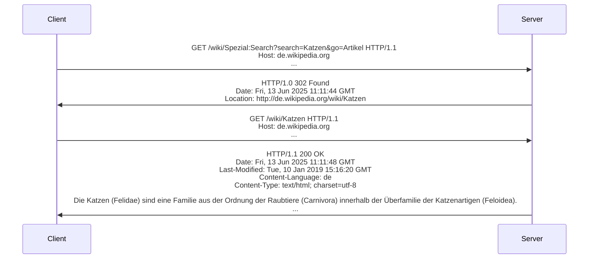

# HTTP: der **GET**-Befehl (3)

```mermaid
sequenceDiagram
  Client->>Server: GET /wiki/Spezial:Search?search=Katzen&go=Artikel HTTP/1.1<br />Host: de.wikipedia.org<br />...
  Server->>Client: HTTP/1.0 302 Found<br />Date: Fri, 13 Jun 2025 11:11:44 GMT<br />Location: http://de.wikipedia.org/wiki/Katzen
  Client->>Server: GET /wiki/Katzen HTTP/1.1<br />Host: de.wikipedia.org<br />...
  Server->>Client: HTTP/1.1 200 OK<br />Date: Fri, 13 Jun 2025 11:11:48 GMT<br />Last-Modified: Tue, 10 Jan 2019 15:16:20 GMT<br />Content-Language: de<br />Content-Type: text/html#59; charset=utf-8<br /><br />Die Katzen (Felidae) sind eine Familie aus der Ordnung der Raubtiere (Carnivora) innerhalb der Überfamilie der Katzenartigen (Feloidea).<br />...
```
