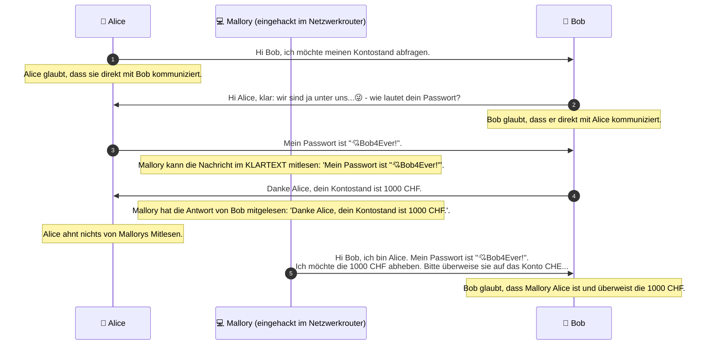
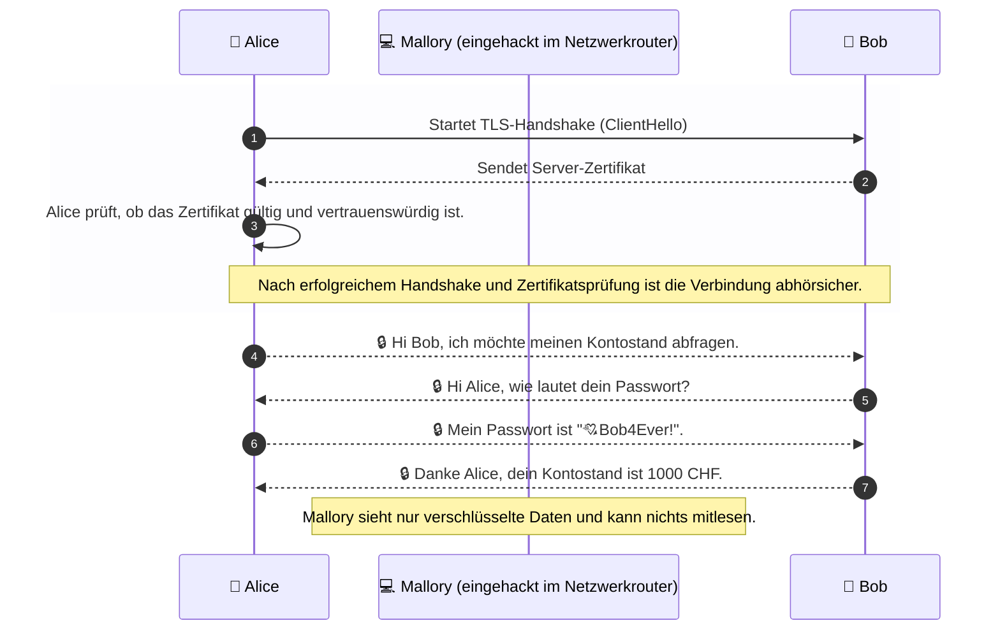
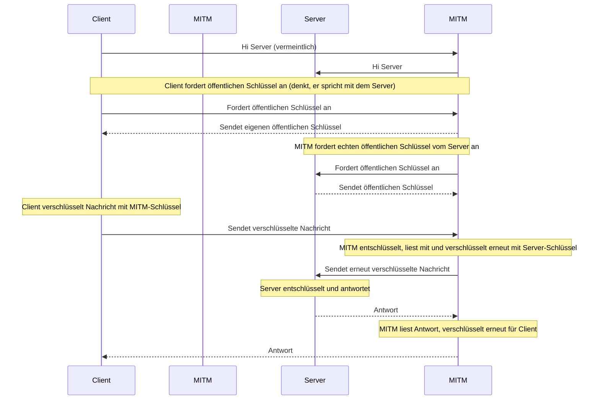

# **NDS - Web Engineering**

## <fluent-emoji-flat-identification-card/> Authentifizierung und Autorisierung <fluent-emoji-flat-locked-with-key/>

---
layout: default
---

# **HTTP**: Das Problem unverschlüsselter Daten

- Bei der Kommunikation über HTTP können Daten im **Klartext** übertragen werden.
- Ein Dritter, der den Datenverkehr abhört, kann die übertragenen Daten im **Klartext** lesen.

---
layout: default
---

# HTTPS: _Hypertext Transfer Protocol **Secure**_

- Über HTTPS können Daten **abhörsicher** übertragen werden _(Transportverschlüsselung)_.
- Die Kommunikation zwischen Client und Server kann nicht von einem Dritten "mitgelesen" werden.
- Der Standard-Port für HTTPS ist **443**. Dieser wird automatisch verwendet, wenn eine URL mit `https://` beginnt.
- Syntaktisch ist HTTPS identisch mit dem Schema für HTTP, die zusätzliche Verschlüsselung der Daten geschieht mittels SSL/TLS.

---
layout: default
---

# HTTPS: _Hypertext Transfer Protocol **Secure**_

---
layout: two-cols-header
---

# X509-Zertifikate: Vorteile und Grenzen

- Via Digitales Zertifikat wird die **Identität** des Servers verifiziert
- z.B. wenn ich mit `https://www.abbts.ch/` kommuniziere, bestätigt ein gültiges Zertifikat, dass ich mit dem echten Besitzer der Domain (`www.abbts.ch`) spreche.
- **ACHTUNG**: ein gültiges Zertifikat garantiert nicht, dass die Website vertrauenswürdig ist! Es bestätigt lediglich die Identität des Servers.

