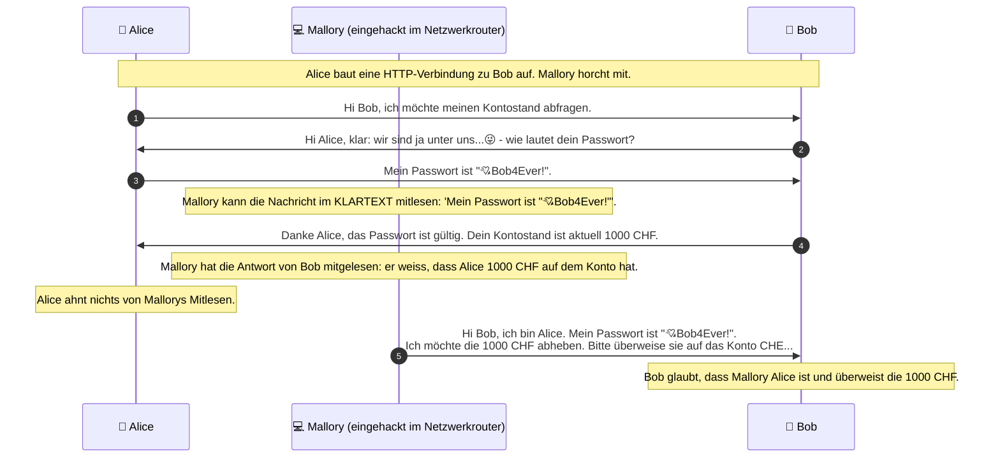
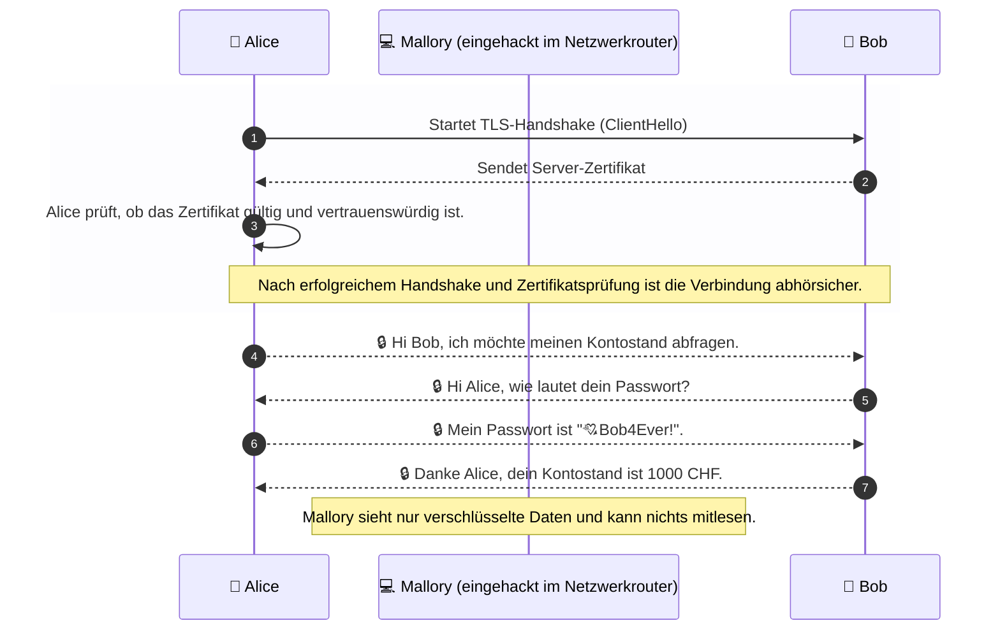
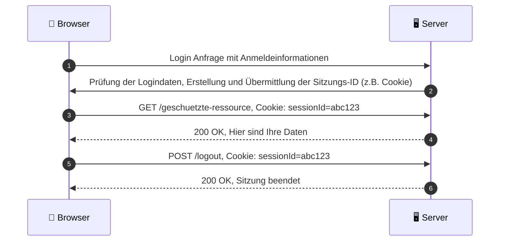

# **NDS - Web Engineering**

## <fluent-emoji-flat-identification-card/> Zugriffsverwaltung und Abhörsicherheit im WWW <fluent-emoji-flat-locked-with-key/>

---
layout: default
transition: slide-left
---

# **Programm**

<v-clicks :depth="2">

1. Abhörsicherheit
   1. HTTP: Das Problem unverschlüsselter Daten
   2. HTTPS und X.509-Zertifikate
2. Authentifizierung: Methoden zur Zutrittskontrolle
3. Deep-Dive: Implementierung
   1. Abhörsicherheit in Ktor
   2. Authentifizierung in Ktor
   3. Besonderheiten in Verbindung mit SPAs

</v-clicks>

---
layout: default
transition: slide-left
---

# **HTTP**: Das Problem unverschlüsselter Daten

- Bei der Kommunikation über HTTP werden Daten im **Klartext** übertragen.
- Ein (böswilliger) **Dritter**, der den Datenverkehr abhört, kann die übertragenen Daten im **Klartext** lesen:

---
layout: default
transition: slide-left
---

# **HTTPS**: _Hypertext Transfer Protocol **Secure**_

- Über **HTTPS** können _Daten_ **abhörsicher** übertragen werden _(Transportverschlüsselung)_.
- Die **Kommunikation** zwischen _Client_ und _Server_ kann _nicht_ von einem _Dritten_ **direkt mitgelesen** werden. Jemand, der den Datenverkehr abhört, sieht nur einen **unlesbaren** Datenstrom.
- Die [Standard-Portnummer](https://de.wikipedia.org/wiki/Port_(Netzwerkadresse)) für HTTPS ist **443**. Dieser wird automatisch verwendet, wenn eine URL mit `https://` beginnt. Der Port kann aber auch explizit angegeben werden, z.B. `https://www.abbts.ch:443/`.
- **HTTPS** ist semantisch eine **Erweiterung von HTTP** und verwendet das _gleiche Protokoll_, bei dem allerdings die **Daten** mittels **SSL/TLS** verschlüsselt werden.

## Interessante Hintergründe

- _HTTPS_ wurde von [Netscape](https://de.wikipedia.org/wiki/Netscape_Communications) entwickelt und zusammen mit _SSL (Secure Socket Layer) 1.0_ erstmals 1994 mit deren Browser ([Netscape Navigator](https://de.wikipedia.org/wiki/Netscape_Navigator), Vorgänger von _Firefox_) veröffentlicht.
- Eine _formale Spezifikation_ von HTTPS wurde im Jahr _2000_ als _RFC 2818_ veröffentlicht. Diese wurde im Jahr _2022_ durch den _Internetstandard RFC 9110_ abgelöst.
- Häufig wird anstatt _SSL_ auch von [TLS (Transport Layer Security)](https://de.wikipedia.org/wiki/Transport_Layer_Security) gesprochen, welches eine Weiterentwicklung von SSL ist.
- SSL 3.0 wurde 1999 veröffentlicht und ist mittlerweile _völlig veraltet_ und _sollte nicht mehr verwendet werden_, da es _bekannte und schwerwiegende Sicherheitslücken_ aufweist.
- Die Begriffe _SSL_ und _TLS_ werden oft _synonym verwendet_, obwohl TLS die neuere und sicherere Version ist.
- Die neueste Version _TLS 1.3_ wurde im _August 2018_ veröffentlicht und ist **seit 2021 der empfohlene Standard**. Ältere Versionen wie _TLS 1.0_ und _1.1_ gelten als _unsicher_ und _sollten nicht mehr verwendet werden_.

---
layout: two-cols-header
transition: slide-left
---

# <fluent-color-certificate-16/> **X.509-Zertifikate**: "Identitätsausweis" im Internet

- X.509 ist ein [ITU-T-Standard](https://de.wikipedia.org/wiki/Internationale_Fernmeldeunion) für eine **strikt hierarchisches System** von **vertrauenswürdigen** [Zertifizierungsstellen](https://de.wikipedia.org/wiki/Zertifizierungsstelle_(Digitale_Zertifikate)) _(englisch certificate authority oder certification authority, kurz CA)_, welche Zertifikate für verschiedene Zwecke (z.B. Codesignierung, Identitätsprüfung von Server oder Client) ausstellen können.
- Ein ausgestelltes digitales Zertifikat wird im X.509-System **immer** an eine **E-Mail-Adresse** oder einen **[DNS](https://de.wikipedia.org/wiki/Domain_Name_System)-Eintrag** _gebunden_.
- z.B. wenn ich mit `https://www.abbts.ch/` kommuniziere, bestätigt ein _gültiges Zertifikat_, dass ich mit dem _echten Besitzer_ der Domain (`www.abbts.ch`) spreche.
- Alle gängigen Webbrowser arbeiten mit _vorkonfigurierten Listen **vertrauenswürdiger** Zertifizierungsstellen_, deren X.509-Zertifikaten der Browser **vertraut**.
  - Viele Webbrowser verwenden die im aktuellen Betriebssystem hinterlegten Listen vertrauenswürdiger CAs, können aber auch eigene Listen haben (z.B. Firefox).
  - Diese Listen werden regelmäßig aktualisiert, um neue vertrauenswürdige CAs hinzuzufügen und potenziell unsichere zu entfernen. Diese Listen können im Normalfall nur mit (lokalen) Administratorrechten geändert werden.
  - Wenn ein Browser ein Zertifikat von einer CA erhält, die nicht in dieser Liste enthalten ist, wird eine Warnung angezeigt, die der Benutzer bei Bedarf auch (auf eigene Gefahr) ignorieren kann.
  - 💡**Hinweis**: Ein Webserver kann im Header mittels [HTTP Strict Transport Security (HSTS)](https://de.wikipedia.org/wiki/HTTP_Strict_Transport_Security) angeben, dass er nur über HTTPS erreichbar sein möchte.
- ‼️**ACHTUNG**: ein gültiges Zertifikat _garantiert **nicht**_, dass die Website _vertrauenswürdig_ ist! Es bestätigt _lediglich_ die _Identität des Servers_ - _nicht_ seine **Absichten**!
- 💡**Nebenbemerkung**: Lange Zeit waren diese Zertifikate ausschliesslich kostenpflichtig erhältlich und mussten oft von Hand gepflegt werden (Ablaufdatum), mittlerweile gibt es auch **kostenlose Zertifizierungsstellen** wie [Let's Encrypt](https://letsencrypt.org/), welche von nahezu allen Hostern unterstützt werden und **automatische Zertifikatsverlängerungen** anbieten.

---
layout: default
transition: slide-left
---

# **Abhörsichere Verbindung**: HTTPS & X.509-Zertifikat

---
layout: default
transition: slide-left
---

# **Authentifizierung**: Methoden zur Zutrittskontrolle

- **Authentifizierung** ist der Prozess, bei dem die Identität eines Benutzers überprüft wird.
- Ziel ist es, sicherzustellen, dass der Benutzer _tatsächlich derjenige ist_, für den er sich _ausgibt_.
- Da HTTP ein _zustandsloses Protokoll_ ist, muss die _Identität des Benutzers_ prinzipiell in **JEDER** _Anfrage an den Server überprüft_ werden.
- Gängige Methoden der Authentifizierung sind:
  - **Basic Authentifizierung**: Benutzername und Passwort werden in JEDER Anfrage gesendet. Dies ist die einfachste Form der Authentifizierung, aber auch die unsicherste, da die Anmeldedaten im Klartext übertragen werden, wenn nicht HTTPS verwendet wird.
  - **Sessionbasierte Authentifizierungen**
    - **Formularbasierte-Authentifizierung**: Der Benutzer gibt seine Anmeldedaten in ein Formular ein, das dann an den Server gesendet wird. Der Server prüft die Anmeldedaten und sendet bei Erfolg ein **Session-Cookie** zurück, das in zukünftigen Anfragen verwendet wird, um den Benutzer zu identifizieren.
    - **Tokenbasierte Authentifizierung**: Der Benutzer erhält nach erfolgreicher Anmeldung ein **Session-Token**, das in zukünftigen Anfragen automatisch vom Webbrowser verwendet wird. Dies ist sicherer als die Basic Authentifizierung, da das Token nicht im Klartext übertragen wird und eine begrenzte Gültigkeitsdauer hat.
  - **JWT (JSON Web Token)**: Eine spezielle Form der tokenbasierten Authentifizierung, bei der das Token in einem JSON-Format vorliegt und zusätzliche Informationen (Claims) enthalten kann. JWTs sind sogenannt selbstvalidierende Tokens, d.h. sie enthalten alle notwendigen Informationen, um ihre Gültigkeit zu überprüfen. Sie werden meist signiert und verschlüsselt, um die Integrität und Vertraulichkeit der Daten zu gewährleisten. Allerdings haben JWTs auch einige Nachteile, wie z.B. die Möglichkeit, die Gültigkeit eines Tokens zu widerrufen, wenn es einmal ausgestellt wurde.

Wir werden in diesem Kurs ausschliesslich **Sessionbasierte Authentifizierungen** behandeln, da diese in **modernen Webanwendungen** am häufigsten verwendet werden und **sehr einfach in der Handhabung** sind. _JWTs_ sind zwar interessant, werden wir aber _nicht behandeln_, da gerade im Bereich der _Gültigkeitsdauer_ und des _Widerrufs von Tokens_ einige **Fallstricke** lauern, die in diesem Kurs den Rahmen sprengen würden.

---
layout: two-cols-header
transition: slide-left
---

## **Sessionbasierte Authentifizierung**

::left::

- Methode zum Verwalten von Statusinformationen über die Interaktionen eines Benutzers mit einer Website oder App
- Nehmen wir an, ein Benutzer möchte auf Daten von einem Anwendungsserver zugreifen:
  1. Der erste Schritt besteht darin, sich über einen Webbrowser mit geheimen Anmeldeinformationen beim Anwendungsserver anzumelden.
  2. Sobald der Server die Anmeldeinformationen überprüft und die Anmeldung erfolgreich war, gibt er eine Antwort an den Webbrowser mit einer eindeutigen Sitzungs-ID.
  3. Die Websites speichern die Sitzungs-IDs in der Regel in Cookies.
  4. Der Webbrowser sendet die Sitzungs-ID bei jeder weiteren Anfrage an den Webserver mit.
  5. Die Sitzung wird auf dem Server verwaltet, und der Server kann die Sitzung bei Bedarf invalidieren (z.B. beim Logout).

::right::

---
layout: default
transition: slide-left
---

# **Implementierung (Server)**: Konfiguration in Ktor

