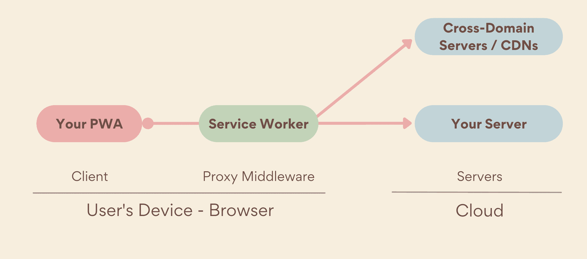

# **NDS - Web Engineering**

## <logos-pwa/> PWA + Vue Advanced <logos-vueuse/>
<style>
  h1 {
    --uno: shadow-filter;
  }
</style>

---
layout: default
transition: slide-left
---

# Programm

<v-clicks :depth="2">

- **PWA**: Progressive Web Apps
  - Service Worker
  - Caching
  - Web App Manifest
  - Benachrichtigungen
  - **Hands-On**: PWA mit Vue und Vite PWA Plugin
- **Vue**: Fortgeschrittene Techniken & Tools
  - Web Storage API & Local Storage
  - IndexedDB
  - VueUse

</v-clicks>

---
layout: default
transition: slide-left
---

# <logos-pwa/> **Progressive Web Apps** (PWA)

> Gute und ausführliche Lernressource: https://web.dev/learn/pwa/

- Progressive Web Apps (PWA) sind Webanwendungen, die moderne Webtechnologien nutzen, um eine App-ähnliche Erfahrung zu bieten.
- Ziel ist es, die Vorteile von Web- und nativen Apps zu kombinieren, um eine bessere Benutzererfahrung zu schaffen.
- Wichtige Merkmale von PWAs:
  - **Offline-Fähigkeit**: Funktionieren auch ohne Internetverbindung.
  - **Installierbarkeit**: Können auf dem Startbildschirm des Geräts installiert werden.
  - **Push-Benachrichtigungen**: Ermöglichen die Kommunikation mit Benutzern.
- Technologien, die PWAs ermöglichen:
  - **Service Worker**: Skripte, die im Hintergrund laufen und Funktionen wie Caching und Push-Benachrichtigungen ermöglichen.
  - **Web App Manifest**: JSON-Datei, die Metadaten über die App enthält, wie Name, Icons und Start-URL.

---
layout: two-cols
transition: slide-left
---

# Service Worker

- [Service Worker](https://web.dev/learn/pwa/service-workers) sind JS-Skripte, die im Hintergrund des Browsers laufen und Funktionen wie Caching, Push-Benachrichtigungen und Hintergrund-Synchronisation ermöglichen.
- Service Worker sind unabhängig von der Webseite und können auch dann arbeiten, wenn die Webseite nicht geöffnet ist.
- Sie werden über das [ServiceWorker API](https://developer.mozilla.org/en-US/docs/Web/API/Service_Worker_API) registriert und verwaltet.

::right::



> Service Worker werden nicht von allen Browsern unterstützt, aber die meisten modernen Browser haben diese Funktion implementiert.
> Hier kommt die Philosophie von Progressive Enhancement ins Spiel: Die Webseite funktioniert auch ohne Service Worker, aber wenn der Browser diese Funktion unterstützt, kann die Webseite zusätzliche Funktionen bieten.
> **Dieses Verhalten funktioniert nicht "out of the box", sondern muss explizit bei Design und Implementation berücksichtigt werden.**

---
layout: default
transition: slide-left
---

# Service Worker (2)

- Die installation eines Service Workers erfolgt in der Regel im Haupt-JavaScript der Webseite:

```javascript
if ('serviceWorker' in navigator) {
   navigator.serviceWorker.register("/serviceworker.js");
}
```

- Service Worker haben verschiedene Lebenszyklus-Ereignisse, wie `install`, `activate` und `fetch`, die es ermöglichen, auf verschiedene Phasen der Service Worker-Nutzung zu reagieren.

```javascript
// This code executes in its own worker or thread
self.addEventListener("install", event => {
   console.log("Service worker installed");
});
self.addEventListener("activate", event => {
   console.log("Service worker activated");
});
self.addEventListener("fetch", event => {
   console.log("Fetching:", event.request.url);
});
```

- Service Worker sind mächtig, aber auch komplex. Es ist bei einer eigenen Implementation daher wichtig, die Grundlagen genau zu verstehen: https://web.dev/learn/pwa/service-workers

<style>
  li {
    --uno: text-sm;
  }
</style>

---
layout: default
transition: slide-left
---

# Caching

- Caching ist ein zentraler Bestandteil von PWAs, der es ermöglicht, Ressourcen (html, js, css, Bilder, Schriftarten, etc.) lokal zu speichern und somit die Leistung und Offline-Fähigkeit zu verbessern.
- Caching wird in der Regel im `fetch`-Ereignis des Service Workers implementiert. Hier ein Beispiel für die "Cache First"-Strategie:

```javascript
self.addEventListener("fetch", event => {
   event.respondWith(
      caches.match(event.request).then(cachedResponse => {
         if (cachedResponse) {
            return cachedResponse;
         }
         return fetch(event.request).then(networkResponse => {
            return caches.open("my-cache").then(cache => {
               cache.put(event.request, networkResponse.clone());
               return networkResponse;
            });
         });
      })
   );
});
```

- Es gibt auch Bibliotheken wie [Workbox](https://developers.google.com/web/tools/workbox), die das Caching und die Verwaltung von Service Workern vereinfachen.
- Workbox bietet eine Reihe von vordefinierten Strategien und Utilities, die die Implementierung von Service Workern erleichtern und Best Practices fördern.
- Weitere Informationen zum Caching mit Service Workern: https://web.dev/learn/pwa/caching

<style>
  li {
    --uno: text-sm;
  }
</style>

---
layout: default
transition: slide-left
---

# Caching Strategien

> Die Wahl der richtigen Caching-Strategie hängt von den Anforderungen der Anwendung und den erwarteten Nutzungsszenarien ab.

- **Cache First**: Zuerst wird im Cache nach der Ressource gesucht. Wenn sie dort gefunden wird, wird sie zurückgegeben. Andernfalls wird sie aus dem Netzwerk geladen und im Cache gespeichert.
- **Network First**: Zuerst wird versucht, die Ressource aus dem Netzwerk zu laden. Wenn dies fehlschlägt (z.B. bei Offlinenutzung), wird die Ressource aus dem Cache zurückgegeben.
- **Stale While Revalidate**: Die Ressource wird sofort aus dem Cache zurückgegeben, während im Hintergrund eine Aktualisierung aus dem Netzwerk durchgeführt wird. Sobald die neue Ressource verfügbar ist, wird der Cache aktualisiert.
- **Cache Only**: Die Ressource wird ausschließlich aus dem Cache geladen. Wenn sie nicht im Cache vorhanden ist, wird ein Fehler zurückgegeben.
- **Network Only**: Die Ressource wird ausschließlich aus dem Netzwerk geladen. Wenn das Netzwerk nicht verfügbar ist, wird ein Fehler zurückgegeben.

---
layout: two-cols-header
transition: slide-left
---

# Web App Manifest

- Das Web App Manifest ist eine JSON-Datei, die Metadaten über die Webanwendung enthält, wie z.B. Name, Icons, Start-URL und Anzeigeoptionen.
- Es ermöglicht es, die Webanwendung auf dem Startbildschirm des Geräts zu installieren und das Erscheinungsbild der Anwendung zu steuern, wenn sie als PWA ausgeführt wird.

::left::

```json
{
  "name": "Meine PWA",
  "short_name": "PWA",
  "start_url": "/index.html",
  "display": "standalone",
  "background_color": "#ffffff",
  "theme_color": "#000000",
  "icons": [
    {
      "src": "/icons/icon-192x192.png",
      "sizes": "192x192",
      "type": "image/png"
    },
    {
      "src": "/icons/icon-512x512.png",
      "sizes": "512x512",
      "type": "image/png"
    }
  ]
}
```

::right::

- Das Manifest wird im HTML-Dokument der Webseite verlinkt:

```html
<link rel="manifest" href="/manifest.json">
```

- Es gibt verschiedene Tools und Generatoren, die bei der Erstellung eines Web App Manifests helfen können, z.B. [App Manifest Generator](https://app-manifest.firebaseapp.com/).
- Zudem müssen die Icons in verschiedenen Grössen bereitgestellt werden, damit sie auf unterschiedlichen Geräten und Bildschirmauflösungen gut aussehen. Dafür gibt es ebenfalls Tools, z.B. [PWA Assets Generator](https://vite-pwa-org.netlify.app/assets-generator/).
- Weitere Informationen zum Web App Manifest: https://web.dev/learn/pwa/web-app-manifest

<style>
  li {
    --uno: text-sm;
  }
</style>

---
layout: two-cols
transition: slide-left
---

# Benachrichtigungen

- Benachrichtigungen sind ein wichtiger Bestandteil von PWAs, da sie es ermöglichen, Benutzer auch dann zu erreichen, wenn die Anwendung nicht aktiv genutzt wird.
- Benachrichtigungen werden in der Regel in Kombination mit Service Workern verwendet, um Benachrichtigungen im Hintergrund zu empfangen und anzuzeigen.
- Die Implementierung von Benachrichtigungen umfasst in der Regel folgende Schritte:
  1. Registrierung eines Service Workers
  2. Anfrage der Berechtigung vom Benutzer
  3. Empfang und Anzeige von Benachrichtigungen

::right::

- Beispielhafte Verwendung des Push API in einer Vue-App:

```typescript
import { ref, onMounted } from "vue";
const message = ref("This is a push notification!");
const permission = ref<NotificationPermission | null>(null);

onMounted(async () => {
  if ("Notification" in window) {
    permission.value = await Notification.requestPermission();
  }
});

function sendNotification() {
  new Notification("Welcome!", {
    body: message.value,
  });
}
```

<style>
  li {
    --uno: text-sm;
  }
</style>

---
layout: default
transition: slide-left
---

# **Hands-On**: PWA mit Vue und Vite PWA Plugin

- [Vite PWA Plugin](https://vite-pwa-org.netlify.app/) ist ein Plugin für Vite, das die Erstellung von PWAs mit Vue (oder anderen Frameworks) vereinfacht und vieles Automatisiert:
  - Automatische Generierung des Service Workers
  - Unterstützung für verschiedene Caching-Strategien
  - Automatische Generierung des Web App Manifests
  - Unterstützung für Workbox
- Source Code: <https://github.com/teaching-abbts/smart-home-system>

## Themen

- Integration des Vite PWA Plugins in ein Vue-Projekt
- Konfiguration des Service Workers und des Web App Manifests in `vite.config.ts`
- Konfiguration von **Caching-Strategien** für `fetch`-Ereignisse im Service Worker für `/gallery`
- Demo mit Offline-Funktionalität

---
layout: default
transition: slide-left
---

# Web Storage API

- Die Web Storage API ist eine Sammlung von Mechanismen, die es ermöglichen, Daten lokal im Browser zu speichern. Es gibt zwei Haupttypen von Web Storage:
  - **Local Storage**: Speichert Daten ohne Ablaufdatum. Die Daten bleiben auch nach dem Schließen des Browsers erhalten.
  - **Session Storage**: Speichert Daten nur für die Dauer der Sitzung. Die Daten werden gelöscht, wenn der Browser oder Tab geschlossen wird.
- Beide Speicherarten sind einfach zu verwenden und bieten eine API zum Speichern, Abrufen und Löschen von Daten.

> Weitere Informationen zur Web Storage API: https://developer.mozilla.org/en-US/docs/Web/API/Web_Storage_API

---
layout: default
transition: slide-left
---

# Local Storage

- Local Storage speichert die Daten lokal im Browser: sie sind **nur für die Domain verfügbar**, unter der sie gespeichert wurden.
- Die Daten bleiben auch nach dem Schließen des Browsers erhalten.
- Local Storage ist einfach zu verwenden und eignet sich gut für die Speicherung kleiner Datenmengen, wie z.B. Benutzereinstellungen oder Tokens.
- Die API ist einfach und besteht aus zwei Hauptmethoden: `setItem` zum Speichern von Daten und `getItem` zum Abrufen von Daten.

```javascript
// Daten speichern
localStorage.setItem("key", "value");
// Daten abrufen
const value = localStorage.getItem("key");
```

- Local Storage speichert Daten als Strings. Um komplexe Datenstrukturen zu speichern, müssen diese in JSON umgewandelt werden: `JSON.stringify()` und `JSON.parse()`.
- Die Handhabung von Local Storage ist einfach, aber es gibt einige Einschränkungen:
  - Begrenzte Speicherkapazität (ca. 5-10 MB)
  - Daten sind nicht verschlüsselt und können von bösartigen Skripten ausgelesen werden (XSS-Angriffe)
  - Nur synchroner Zugriff, was zu Performance-Problemen führen kann

> Weitere Informationen zu Local Storage: https://developer.mozilla.org/en-US/docs/Web/API/Window/localStorage

<style>
  li {
    --uno: text-sm;
  }
</style>

---
layout: default
transition: slide-left
---
# IndexedDB

- IndexedDB ist eine Low-Level-API für die clientseitige Speicherung großer Mengen strukturierter Daten, einschließlich Dateien und BLOBs ("Binary Large Objects" = Binärdateien).
  - Es lassen sich auch sehr grosse Datenmengen speichern (mehrere hundert MB oder sogar GB, je nach Browser).
- Im Gegensatz zu Local Storage und Session Storage, die einfache Schlüssel-Wert-Paare speichern, ermöglicht IndexedDB die Speicherung komplexer Datenstrukturen und bietet leistungsstarke Abfragefunktionen: also eine NoSQL-Datenbank im Browser.
- IndexedDB ist asynchron und basiert auf Ereignissen, was bedeutet, dass Operationen wie das Öffnen einer Datenbank oder das Abrufen von Daten nicht sofort abgeschlossen sind.
- Die API ist komplexer als die von Local Storage, aber es gibt Bibliotheken wie [Dexie.js](https://dexie.org/) oder [idb](https://github.com/jakearchibald/idb), die die Arbeit mit IndexedDB erleichtern.
- IndexedDB ist ideal für Anwendungen, die große Datenmengen speichern müssen, wie z.B. Offline-Anwendungen, Notizen-Apps oder komplexe Webanwendungen.

> Weitere Informationen zu IndexedDB: https://developer.mozilla.org/en-US/docs/Web/API/IndexedDB_API

<style>
  li {
    --uno: text-sm;
  }
</style>

---
layout: two-cols-header
transition: slide-left
---

# IndexedDB (2)

Beispielhafte Verwendung von IndexedDB mit [Dexie.js](https://dexie.org/):

::left::

```javascript {monaco} { lineNumbers: 'on', height: '400px' }
const db = new Dexie('MyDatabase');

// Declare tables, IDs and indexes
db.version(1).stores({
  friends: '++id, name, age'
});

// Find some old friends
const oldFriends = await db.friends
  .where('age').above(75)
  .toArray();

// or make a new one
await db.friends.add({
  name: 'Camilla',
  age: 25,
  street: 'East 13:th Street',
  picture: await getBlob('camilla.png')
});

```

::right::

```html {monaco} { lineNumbers: 'on', height: '400px' }
<template>
  <h2>Friends</h2>
  <ul>
    <li v-for="friend in friends" :key="friend.id">
      {{ friend.name }}, {{ friend.age }}
    </li>
  </ul>
</template>
<script setup>
  import { db } from "../db";
  import { liveQuery } from "dexie";
  import { useObservable } from "@vueuse/rxjs";

  const friends = useObservable(
    liveQuery(async () => {
      return await db.friends
        .where("age")
        .between(18, 65)
        .toArray();
    })
  )
</script>
```

---
layout: default
transition: slide-left
---

# <logos-vueuse/> VueUse

- [VueUse](https://vueuse.org/) ist eine Sammlung von nützlichen, wiederverwendbaren Composition API Hooks für Vue 3.
- Es bietet eine Vielzahl von Funktionen, die die Entwicklung von Vue-Anwendungen erleichtern, darunter:
  - Reaktive State-Management-Hooks
  - Browser-APIs (z.B. Web Storage, Geolocation, Media Queries)
  - Utility-Hooks (z.B. Debounce, Throttle, Event Listener)
  - Integration mit Drittanbieter-Bibliotheken (z.B. RxJS, Firebase)
- VueUse ist modular aufgebaut, sodass nur die benötigten Hooks importiert werden können, was die Bundle-Größe reduziert.
- Es ist gut dokumentiert und wird aktiv gepflegt, was es zu einer beliebten Wahl für Vue-Entwickler macht.

---
layout: default
transition: slide-left
---

# **Hands-On** Web Storage mit VueUse

- `AppThemeSwitch.vue`: Theme-Switcher mit Speicherung im Local Storage mit hilfe von VueUse
- "Shopping" in der [VueUse Dokumentation](https://vueuse.org/functions.html)... was gibt es sonst noch so nützliches?
  - https://vueuse.org/core/useDraggable/
  - https://vueuse.org/core/useDropZone/
  - https://vueuse.org/core/useRefHistory/#userefhistory
  - https://vueuse.org/core/useGeolocation/#usegeolocation
  - https://vueuse.org/core/useMagicKeys/
  - https://vueuse.org/integrations/useIDBKeyval/
  - https://vueuse.org/integrations/useJwt/

---
layout: default
transition: slide-left
---

# <noto-joker/> Jocker-Teil: Weitere Themen..?

> Falls noch Zeit bleibt...

- Gibt es noch weitere Themen, die euch interessieren?

---
layout: default
transition: slide-left
---

# Feedback zur Vorlesung

- Was hat euch gut gefallen?
- Was hat euch weniger gut gefallen?
- Wo seht ihr Verbesserungspotenzial?
- Welche Themen würdet ihr gerne vertiefen?

---
layout: default
transition: slide-left
---

# Ende dieser Vorlesung

<div class="text-center mt-9">

Vielen herzlichen Dank für eure **Aufmerksamkeit**, eure **Mitarbeit** und die **tollen Diskussionen** 💝!

**Ich wünsche euch viel Erfolg bei eurer Diplomarbeit!!**

</div>
