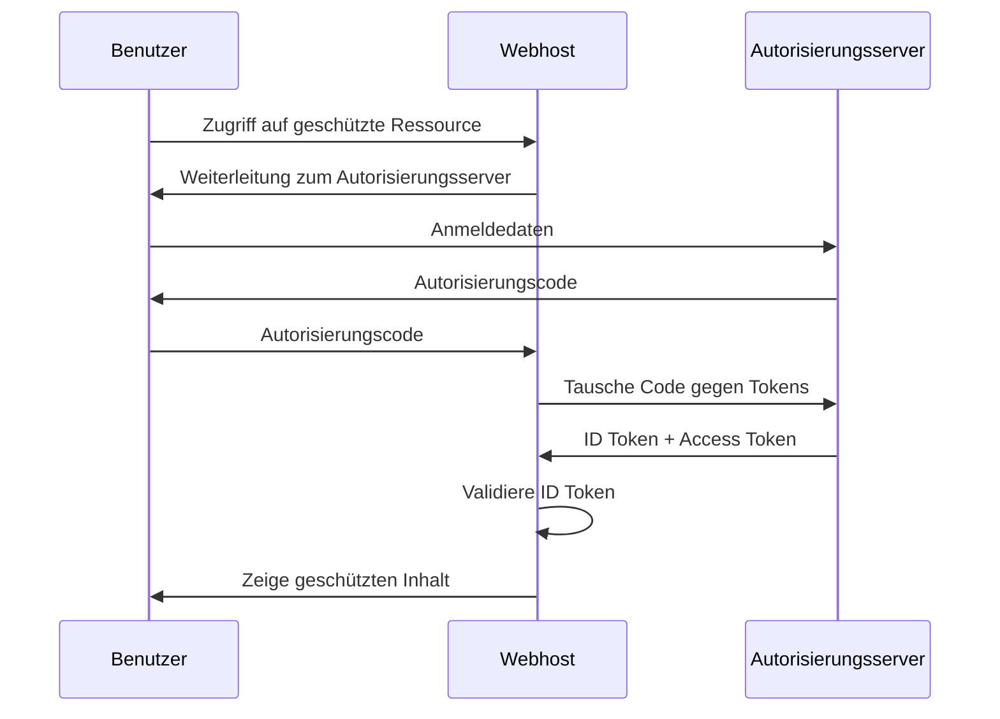

# **NDS - Web Engineering**

## Zertifikate <fluent-color-certificate-16/>, Autorisierung mit OIDC, Pinia <logos-pinia/>
<style>
  h1 {
    --uno: shadow-filter;
  }
</style>

---
layout: default
transition: slide-left
---

# Programm

<v-clicks :depth="2">

- HTTPS in **Ktor**
  - X.509 Zertifikate _(self-signed)_
  - Umleitung von HTTP auf HTTPS
- Ktor: Authentifizierung mit **OIDC**
- Vue: State-Management mit **Pinia**
- **Hands-On**: OIDC mit Keycloak und Ktor
  - Implementation von OIDC in Ktor mit Session Cookies
  - Detailanalyse der aktuellen Solution
</v-clicks>

---
layout: default
transition: slide-left
---

# X.509 Zertifikat in **Ktor**

- In unserer Lösung setzen wir bekanntlich Ktor mit der [Netty-Engine](https://netty.io/) in der [Configuration as (YAML-)File](https://ktor.io/docs/server-create-and-configure.html#engine-main)-Variante ein.
- Dadurch ist die verwendung von HTTPS und X.509-Zertifikaten in Ktor-Anwendungen sehr einfach:

```yaml
ktor:
  application:
    modules:
      - ch.abbts.ApplicationKt.myModule
  deployment:
    port: 8080
    sslPort: 8443
  security:
    ssl:
      keyStore: keystore.jks
      keyAlias: sampleAlias
      keyStorePassword: foobar
      privateKeyPassword: foobar
```

- Mittels `Keytool` Utility des JDK kann ein `keystore` mit einem selbstsignierten Zertifikat erstellt werden:

```bash
keytool -keystore keystore.jks -alias sampleAlias -genkeypair -keyalg RSA -keysize 4096 -validity 3 -dname 'CN=localhost, OU=ktor, O=ktor, L=Unspecified, ST=Unspecified, C=CH'
```

- Lösungen mittels der `embeddedServer`-Variante sind ebenfalls möglich - siehe [Dokumentation](https://ktor.io/docs/server-ssl.html#embedded-server).

<style>
  li {
    --uno: text-sm;
  }
</style>

---
layout: default
transition: slide-left
---

# HTTPS Redirect

- Häufig wird im Alltag eine Webseite ohne vollständige Protokollangabe aufgerufen, z.B. `www.example.com` anstelle von `https://www.example.com`. Standardmässig wird somit also aus `www.example.com` eine HTTP-Anfrage: `http://www.example.com`.
- Seit ein paar Jahren ist es üblich, dass Webseiten nur noch über HTTPS erreichbar sind.
- In der Praxis ist es somit üblich, dass HTTP-Anfragen automatisch auf HTTPS umgeleitet werden.
- In Ktor kann dies einfach durch die Verwendung des `HttpsRedirect`-Features erreicht werden:

```kotlin
import io.ktor.server.application.*
import io.ktor.server.plugins.httpsredirect.*

fun Application.setupHttpsRedirect() {
  install(HttpsRedirect) {
    sslPort = 8443
    permanentRedirect = false
  }
}
```

<style>
  li {
    --uno: text-sm;
  }
</style>

---
layout: default
transition: slide-left
---

# OpenID Connect (OIDC)

- OIDC ist ein vollständiges Authentifizierungsprotokoll, das auf OAuth 2.0 aufbaut und somit sowohl **Authentifizierung** als auch **Autorisierung** ermöglicht.
- Es ermöglicht Clients, die Identität von Benutzern zu überprüfen und grundlegende Profilinformationen abzurufen.
- Es bietet eine standardisierte Möglichkeit zur Implementierung von Single Sign-On (SSO) und zur Integration von Identitätsanbietern wie z.B. Microsoft, Google, Facebook oder auch ein Corporate Identity Provider.



<style>
  li {
    --uno: text-sm;
  }
</style>

---
layout: two-cols-header
transition: slide-left
---

# State-Management mit **Pinia** <logos-pinia/>

- Pinia ist der offizielle State-Management-Lösung für Vue 3 und bietet eine einfache und intuitive API zur Verwaltung des globalen Zustands in Vue-Anwendungen.

::left::

`stores/user.ts`

```js {monaco} { lineNumbers: 'on', height: '350px' }
import { defineStore } from 'pinia'
import { ref, computed } from 'vue'

export const useUserStore = defineStore('user', () => {
  const name = ref('')
  const email = ref('')

  const displayName = computed(() =>
    name.value ?? 'Anonymous User'
  )

  function reset() {
    name.value = ''
    email.value = ''
  }

  return {
    name,
    email,
    displayName,
    reset
  }
})
```

::right::

`my-component.vue`

```html {monaco} { lineNumbers: 'on', height: '350px' }
<script lang="ts">
import { useUserStore } from '@/stores/user'

const userStore = useUserStore()
</script>

<template>
  <span>{{ userStore.displayName }}</span>
  <button @click="userStore.reset()">Reset</button>
</template>
```

<style>
  li {
    --uno: text-sm;
  }
</style>

---
layout: default
transition: slide-left
---

# **Hands-On**: OIDC mit Keycloak und Ktor

<https://github.com/teaching-abbts/smart-home-system/tree/day-8/cert%2Boidc>

**Themen:**

- [Keycloak](https://www.keycloak.org/) als Beispiel eines [Identity Provider](https://de.wikipedia.org/wiki/Identit%C3%A4tsanbieter)
- Integration von OIDC in Ktor
- Implementierung von Login- und Logout via Keycloak
- Abfrage von Benutzerinformationen, welche von Keycloak geliefert werden
- Zentrale Integration der User-Infos via Pinia-Store im Frontend

---
transition: slide-left
---

# **Ausblick**: Restliche Themen dieser Vorlesung

## Domäne

- **ABB-TS Smart-Home**: Vue.js App mit Ktor Backend steuert Smart-Home Geräte an

## Technologien

- **Progressive Web Apps**:
  - Offline-Funktionalität (Local Storage, IndexedDB)
  - App Manifest & installation
  - OS Integration

---
layout: default
transition: slide-left
---

# Ende der heutigen Veranstaltung

<div class="text-center mt-9">

Vielen herzlichen Dank für eure **Aufmerksamkeit** und **Mitarbeit** 💝!

</div>
