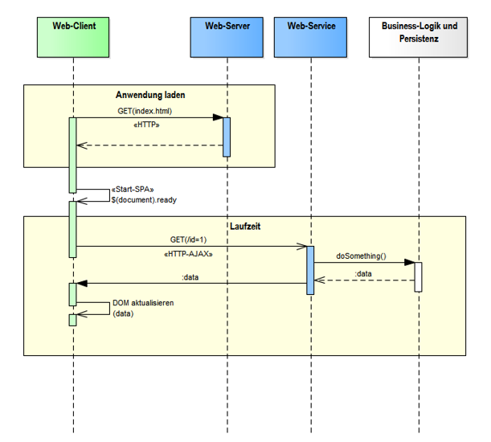
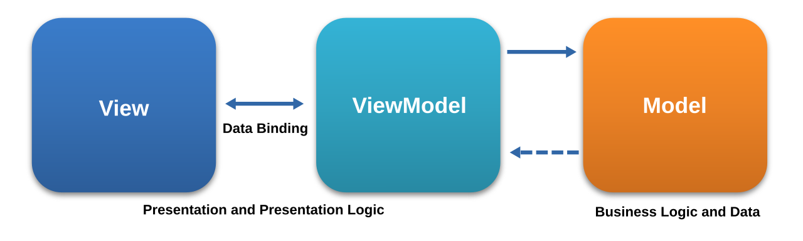

# **NDS - Web Engineering**

## Single Page Applications mit Vue.js

<style>
  h1 {
    --uno: shadow-filter;
  }
</style>

---

# Programm

<v-clicks :depth="2">

1. Besprechung Hausaufgaben & Lösungen
2. Single Page Applications (SPAs)
3. Einführung in das SPA-Framework Vue.js
4. Einfache TODO-App mit Vue.js

</v-clicks>

---

# **Lösungsvorschlag**: Einfache Bildergalerie

```csharp {monaco} { lineNumbers: 'on', height: '400px' }
var builder = WebApplication.CreateBuilder(args);
var app = builder.Build();

app.UseStaticFiles();

app.MapGet(
  "/image-gallery",
  () =>
  {
    var webRootPath =
      app.Environment.WebRootPath ?? Path.Combine(app.Environment.ContentRootPath, "wwwroot");
    var uploadsFolder = Path.Combine(webRootPath, "uploads");
    Directory.CreateDirectory(uploadsFolder);

    var imageFiles = Directory
      .GetFiles(uploadsFolder)
      .Select(Path.GetFileName)
      .Where(f => f is not null)
      .Cast<string>()
      .ToList();

    var imageItems = string.Join("\n", imageFiles.Select(GalleryItem));
    var emptyMessage = imageFiles.Count == 0 ? "<p>Keine Bilder vorhanden.</p>" : string.Empty;

    return HtmlPage(
      "Bildgalerie",
      """
      body {
        font-family: sans-serif;
        padding: 20px;
        background: #f5f5f5;
      }
      h2 {
        text-align: center;
      }
      .toolbar {
        text-align: center;
        margin-bottom: 20px;
      }
      .gallery {
        display: flex;
        flex-wrap: wrap;
        gap: 16px;
        justify-content: center;
      }
      .gallery-item {
        background: white;
        border-radius: 8px;
        box-shadow: 0 2px 6px rgba(0,0,0,0.15);
        overflow: hidden;
        width: calc(33% - 16px);
        min-width: 200px;
        display: flex;
        flex-direction: column;
        align-items: center;
        padding-bottom: 10px;
      }
      .gallery-item img {
        width: 100%;
        height: 200px;
        object-fit: cover;
      }
      .gallery-item button {
        margin-top: 8px;
        padding: 4px 12px;
        cursor: pointer;
        background: #e53935;
        color: white;
        border: none;
        border-radius: 4px;
      }
      .gallery-item button:hover {
        background: #b71c1c;
      }
      a.btn {
        display: inline-block;
        padding: 8px 16px;
        background: #1976d2;
        color: white;
        text-decoration: none;
        border-radius: 4px;
      }
      a.btn:hover {
        background: #0d47a1;
      }
      """,
      $"""
      <h2>Bildgalerie</h2>
      <div class="toolbar">
        <a class="btn" href="/image-gallery/upload">Bilder hochladen</a>
      </div>
      {emptyMessage}
      <div class="gallery">
      {imageItems}
      </div>
      """
    );
  }
);

app.MapGet(
  "/image-gallery/upload",
  () =>
    HtmlPage(
      "Bilder hochladen",
      """
      body {
        font-family: sans-serif;
        background: #f5f5f5;
        padding: 20px;
      }
      h2 {
        text-align: center;
      }
      form {
        width: 360px;
        margin: 0 auto;
        padding: 24px;
        background: white;
        border-radius: 10px;
        box-shadow: 0 2px 8px rgba(0,0,0,0.1);
      }
      label {
        display: block;
        margin-bottom: 6px;
        font-weight: bold;
      }
      input[type="file"] {
        width: 100%;
      }
      input[type="submit"] {
        margin-top: 14px;
        padding: 8px 16px;
        background: #1976d2;
        color: white;
        border: none;
        border-radius: 4px;
        cursor: pointer;
      }
      input[type="submit"]:hover {
        background: #0d47a1;
      }
      .back {
        display: block;
        text-align: center;
        margin-top: 14px;
      }
      """,
      """
      <h2>Bilder hochladen</h2>
      <form action="/image-gallery/upload" method="post" enctype="multipart/form-data">
        <label for="files">Bilder auswählen:</label>
        <input type="file" id="files" name="files" accept="image/*" multiple required />
        <input type="submit" value="Hochladen" />
      </form>
      <a class="back" href="/image-gallery">← Zurück zur Galerie</a>
      """
    )
);

app.MapPost(
  "/image-gallery/upload",
  async (HttpRequest request) =>
  {
    if (!request.HasFormContentType)
    {
      return Results.BadRequest("Multipart-Formulardaten erwartet.");
    }

    var form = await request.ReadFormAsync();

    if (form.Files.Count == 0)
    {
      return Results.BadRequest("Keine Dateien übermittelt.");
    }

    var webRootPath =
      app.Environment.WebRootPath ?? Path.Combine(app.Environment.ContentRootPath, "wwwroot");
    var uploadsFolder = Path.Combine(webRootPath, "uploads");
    Directory.CreateDirectory(uploadsFolder);

    foreach (var file in form.Files)
    {
      if (file.Length == 0)
      {
        continue;
      }

      if (
        file.ContentType is null
        || !file.ContentType.StartsWith("image/", StringComparison.OrdinalIgnoreCase)
      )
      {
        return Results.BadRequest(
          $"'{System.Net.WebUtility.HtmlEncode(file.FileName)}' ist kein gültiges Bild."
        );
      }

      var extension = Path.GetExtension(file.FileName);
      var fileName = $"{Guid.NewGuid():N}{extension}";
      var filePath = Path.Combine(uploadsFolder, fileName);

      await using var stream = File.Create(filePath);
      await file.CopyToAsync(stream);
    }

    return Results.Redirect("/image-gallery");
  }
);

app.MapPost(
  "/image-gallery/delete/{fileName}",
  (string fileName) =>
  {
    var safeFileName = Path.GetFileName(fileName);

    if (string.IsNullOrWhiteSpace(safeFileName))
    {
      return Results.BadRequest("Ungültiger Dateiname.");
    }

    var webRootPath =
      app.Environment.WebRootPath ?? Path.Combine(app.Environment.ContentRootPath, "wwwroot");
    var filePath = Path.Combine(webRootPath, "uploads", safeFileName);

    if (File.Exists(filePath))
    {
      File.Delete(filePath);
    }

    return Results.Redirect("/image-gallery");
  }
);

app.MapGet("/", () => Results.Redirect("/image-gallery"));

app.Run();

IResult HtmlPage(string title, string styles, string body) =>
  Results.Content(
    $"""
    <!DOCTYPE HTML>
    <html>
      <head>
        <meta charset="UTF-8" />
        <title>{title}</title>
        <style>
    {styles}
        </style>
      </head>
      <body>
    {body}
      </body>
    </html>
    """,
    "text/html"
  );

string GalleryItem(string fileName) =>
  $"""
  <div class="gallery-item">
    
    <form method="post" action="/image-gallery/delete/{Uri.EscapeDataString(fileName)}">
      <button type="submit">Löschen</button>
    </form>
  </div>
  """;
```

---
layout: two-cols-header
---

# Was ist eine Single-Page-Webanwendung (SPA)?

::left::

<v-clicks :depth="2">

- Als **Single-Page-Webanwendung** (englisch single-page application, kurz SPA) oder Einzelseiten-Webanwendung wird eine **Webanwendung** bezeichnet, die aus **einem einzigen HTML-Dokument** besteht und deren **Inhalte dynamisch nachgeladen** werden.
- Der **Sitzungszustand** wird in der **Client-Applikation gespeichert**, *nicht im Server*.
- Der Webclient ist eine unabhängige Einheit und lädt benötigte Daten bei Bedarf nach.
- SPAs sind von ihrer Funktionsweise her mit «nativen Apps» vergleichbar, welche die Verarbeitung der Daten und deren Darstellung vor Ort auf dem Client (Webbrowser) vollziehen.
- SPAs sind eine Vorstufe zu Progressive Web-Apps (PWAs), welche die allermeisten «Lücken» im Vergleich zu nativen Desktop Applikationen *(Dateizugriff, Offlinefähigkeit, Interaktion mit anderen Anwendungen auf dem PC)* schliessen

</v-clicks>

::right::



<style>
 li {
   --uno: text-sm;
 }
</style>


---
layout: two-cols-header
---

# SPA vs. Native App

::left::

### SPA

<v-clicks depth="2">

- **Zugriff**
  - Keine Installation notwendig – App kann von überall her via HTTP bezogen werden – vollständige Kontrolle
  - Keine Abhängigkeit von (moderierten/kostenpflichtigen) App-Stores
- **Plattformunabhängigkeit**
  - Läuft in jedem modernen Webbrowser
  - Keine (direkte) Abhängigkeit von Betriebssystemen (Windows, macOS, Linux, Android, iOS) und Hardware (PC, Smartphone, Tablet)
- **Performance**
  - Sehr leichtgewichtig (oft nur wenige KB)
  - Kann im direkten Vergleich zu (optimierten) nativen Apps in manchen Fällen langsamer sein (z.B. Games, extrem viele Daten auf Einmal laden)
  - *Aber*: mit modernen Frameworks wie Vue.js sind SPAs sehr performant und es gibt native Schnittstellen (WebAssembly, WebGL, WebGPU) für Performance-intensive Anwendungen
  - In modernen Webbrowsern ist i.d.R. die Leistung für fast alle Anwendungsfälle mehr als ausreichend
- **Kosten**
  - Die Entwicklung von Web-Apps ist, über den ganzen Lebenszyklus betrachtet, in den meisten Fällen kostengünstiger als native Apps
  - Keine Kosten für App-Store-Gebühren
  - Geringere Kosten für Hosting und Betrieb
- **[PWA](https://developer.mozilla.org/en-US/docs/Web/Progressive_web_apps/Guides/What_is_a_progressive_web_app)**
  - Schliesst die meisten relevanten Lücken zu nativen Apps
  - Offline-Funktionalität, Push-Benachrichtigungen, Hintergrundaktualisierungen, uvm.

</v-clicks>

::right::
### Native App
<v-clicks depth="2">

- Spezifische Installationsroutinen für jedes System
- Muss i.d.R. für eine spezifische Platform kompilliert werden
- Kann nativ kompilliert werden – höchste Performance
- Kann ein hohes Sicherheitsrisiko darstellen, da i.d.R. viele Rechte und nativer Zugriff auf das System
- Muss oft via proprietären Store (Apple App Store / Google Play / Microsoft Store, etc.) bezogen werden – ggf. kostenpflichtiges Abo für Entwickler, etc.
- **IMHO des Dozenten**: Viele native Apps sind gerade bei "simplen" Dingen Fehleranfällig (z.B. Abspielfunktion für Musik/Videos streikt, Nachladen geht nicht, App stürzt ab/reagiert nicht, etc.) - dies liegt vermutlich (auch) daran, dass viele dieser "Bausteine" nicht so so stabil und "ausgereift" sind wie die entsprechenden Web-APIs, die in modernen Webbrowsern zur Verfügung stehen und von millarden von Nutzern getestet wurden.

</v-clicks>

<style>
  li {
    --uno: text-xs;
  }
</style>


---

# <devicon-vuejs /> Vue.js

<v-clicks :depth="2">

- [Vue.js](https://vuejs.org/) (französisch für "Ansicht" (View), wird englisch ausgesprochen [vjuː]) ist ein *clientseitiges* **JavaScript-Webframework** zum Erstellen von **Single-Page-Webanwendungen**
- Vue.js ist **freie Software** *(MIT)* und wird von einer *Open-Source-Community entwickelt*.
- Gilt als *leicht erlernbar* im Vergleich zu anderen Frameworks (z.B. Angular, React).
- Seit Jahren eines der *verbreitetsten und beliebtesten* **JavaScript-Frameworks** weltweit und hat **Millionen von Benutzern**
- Vue.js bietet ein reichhaltiges Ökosystem, das von *Build Toolchain* über *Test-Utils*, *IDE-Unterstützung*, *State-Management* und *Client-Side-Routing*, *Server-Side-Rendering* bis hin zu *umfangreichen Debugging-Tools* reicht.
- Vue.js ist sogenannt *progressiv* und kann in bestehenden Projekten schrittweise eingeführt werden:
  - Vue.js kann z.B. vergleichsweise leich in bestehende HTML-Seiten integriert werden, um interaktive Komponenten zu erstellen (ähnlich wie [jQuery](https://jquery.com/)).
  - Erweiterungen und Plugins können nach belieben hinzugefügt werden, um die Funktionalität zu erweitern (z.B. Vue Router für Client-Side-Routing, Pinia für State-Management).

</v-clicks>


---
layout: two-cols-header
---

# Vue.js - Global Build

**ALLES ist HTML/CSS/JavaScript!**

::left::

<<< ./public/assets/day-4-vue.js-global-build.html html {monaco} { lineNumbers: 'on', height: '400px' }

::right::

<iframe src="/assets/day-4-vue.js-global-build.html" style="zoom: 2;" width="100%" height="400px" frameborder="0"></iframe>


---

# Vue.js - Reaktivität

<div></div>

<v-click>



</v-click>

<v-clicks>

- Vue.js verwendet das sog. [MVVM-Entwurfsmuster](https://de.wikipedia.org/wiki/Model_View_ViewModel), welches der *Trennung* zwischen **Darstellung** und **Logik** der *Benutzerschnittstelle (UI)* und dem **Server-Backend** dient.
- Dieses [Entwurfsmuster](https://de.wikipedia.org/wiki/Entwurfsmuster) ist ebenso die **Standardimplementierung** von UI-Plattformen wie *Cocoa (Apple)*, *Windows Presentation Foundation (WPF, Microsoft)* und *JavaFX (Oracle)*
- Das **ViewModel** bildet den *Zustand des UI* wieder, welches sich *durch Benutzereingaben und Ereignisse verändert*.
- **Änderungen** im UI werden **automatisch auf das ViewModel übertragen und umgekehrt** (sogenannt *Bi-direktionales DataBinding*)

</v-clicks>

<style>
  li {
    --uno: text-base;
  }
</style>


---
layout: two-cols-header
---

# Vue.js - Grundlegende Konzepte 1

::left::

<<< ./components/DataBinding.vue html {monaco} { lineNumbers: 'on', height: '400px' }

::right::

- `v-model`: bidirektionale Datenbindung *(Vue.js implementiert dies für praktisch alle Typen von Eingabefeldern)*
- `ref()`: reaktive Referenz *(lesen und schreiben)*
- `computed()`: berechnete reaktive Referenz (lesend wie auch schreibend möglich)
- `{{ variable oder ausdruck }}`: Einweg-Datenbindung im Template
- `@click`: Event-Handler für Klick-Ereignisse

<div class="w-full h-full ml-3">
  <DataBinding />
</div>

<style>
  ul {
    --uno: ml-3;
  }
  li {
    --uno: text-sm;
  }
</style>


---
layout: two-cols-header
---

# Vue.js - Grundlegende Konzepte 2

<<< ./components/ConditionsAndLoops.vue html {monaco} { lineNumbers: 'on', height: '200px' }

::left::

- `v-if`, `v-else-if`, `v-else`: Bedingte Anzeige von Elementen
- `v-for`: Iteration über Arrays oder Objekte
- `@keyup.enter`: Event-Handler loslassen der Entertaste
- `:property`: Bindung von Attributen an reaktive Daten

::right::

<div class="w-full h-full flex justify-center">
  <ConditionsAndLoops />
</div>

<style>
  ul {
    --uno: ml-3;
  }
  li {
    --uno: text-sm;
  }
</style>

---
layout: two-cols-header
---

# Vue.js - Class und Style Bindings

::left::

```html {monaco}
<!-- Object binding -->
<div :class="{ active: isActive }"></div>
<!-- Rendering wenn 'isActive' truthy -->
<div class="active"></div>

<!-- Object binding mit statischer Eigenschaft -->
 <div
  class="static"
  :class="{ active: isActive, 'text-danger': hasError }"
></div>
<!-- Mögliches Rendering -->
<div class="static active text-danger"></div>

<!-- Array binding -->
<div :class="[activeClass, errorClass]"></div>
<!-- Mögliches Rendering -->
<div class="active text-danger"></div>

<!-- Setzen via (computed) reactive -->
<div :class="computedClass"></div>
<!-- Mögliches Rendering -->
<div class="active text-danger"></div>
```

::right::

```js {monaco}
import { ref, computed } from 'vue'

const isActive = ref(true)
const hasError = ref(false)
const activeClass = ref('active')
const errorClass = ref('text-danger')

const computedClass = computed(() => {
  return {
    active: isActive.value,
    'text-danger': hasError.value
  }
})
```


---

# **Arbeitsauftrag**: Todo-App mit Vue.js

<div></div>

- Wir erstellen nun erneut die Todo-App vom Tag 2 - diesmal jedoch mit Vue.js
- Nutzen sie die Vue.js Konzepte, die Sie in den letzten Slides gesehen haben
- Nehmen sie folgenden Quellcode, welcher bereits den **Vue.js Global-Build** enthält, als Basis

<<< ./public/assets/day-4-vue.js-todo-app.html html {monaco} { lineNumbers: 'on', height: '300px' }


---

# Hausaufgabe

1. Spielen sie auf nächste Woche das offizielle Vue.js Tutorial durch: <https://vuejs.org/tutorial>
   - *(alternativ)* Für motivierte Teilnehmer:innen: sie können auch das längere, aber ausführlichere W3CSchools Tutorial durchspielen: <https://www.w3schools.com/vue/index.php> *(machen sie, soweit sie kommen...)*
2. Beenden sie die heutige Aufgabe (**Todo-App** mit Vue.js), falls sie noch nicht fertig geworden sind


---

# Ende der heutigen Veranstaltung

<div class="text-center mt-9">

Vielen herzlichen Dank für eure **Aufmerksamkeit** und **Mitarbeit** 💝!

Kommt alle gut nach Hause, viel Erfolg bei den Hausaufgaben und eine gute, lehrreiche Woche👌

👋 bis nächsten Freitag!

</div>

