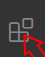
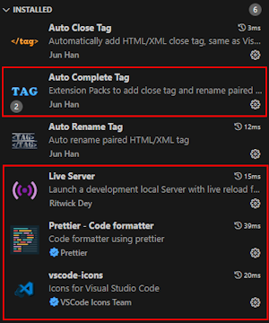
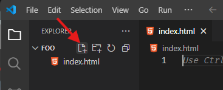
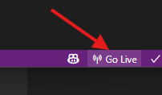

# **NDS - Web Engineering**

## Einführung & Grundlagen 1

<style>
  h1 {
    --uno: shadow-filter;
  }
</style>

---
layout: image-left
image: /images/Hannes.jpg
transition: slide-left
title: Steckbrief Dozent
---

## Steckbrief Dozent

| _Key_     | _Value_                                                                                                                                                                       |
| --------- | ----------------------------------------------------------------------------------------------------------------------------------------------------------------------------- |
| Name      | **Hannes Morgenthaler**                                                                                                                                                       |
| Alter     | Über **41x** um die <fluent-emoji-sun /> gekreist...                                                                                                                          |
| Herkunft  | Aus dem Westen der CH (Fribourg), Erde <fluent-emoji-globe-showing-europe-africa /> _(angeblich)_                                                                             |
| Abschluss | BSc. Informatik FH                                                                                                                                                            |
| Job       | Lead Software Developer & Architekt, [INGTES AG](https://www.intes.ch)                                                                                                        |
| Erfahrung | <span class="text-xs">Webseiten & Frontend: 21 Jahre</span><br /><span class="text-xs">Fullstack Developer: 13 Jahre</span><br /><span class="text-xs">Dozent: 3 Jahre</span> |

---

# **Frage**: wie schätzt **DU** dein Vorwissen zu diesem Modul ein?

| Skala                                     | Beschreibung                                                    | Anzahl Stimmen |
| ----------------------------------------- | --------------------------------------------------------------- | -------------- |
| <fluent-emoji-nerd-face v-for="n in 1" /> | Webbrowser, was ist das..?                                      |                |
| <fluent-emoji-nerd-face v-for="n in 2" /> | Web-Power-User mit Addblockern und weiteren Extensions          |                |
| <fluent-emoji-nerd-face v-for="n in 3" /> | Hab schon mal was von HTML/CSS/JS gehört...                     |                |
| <fluent-emoji-nerd-face v-for="n in 4" /> | Habe schon selber HTML/CSS/JS geschrieben                       |                |
| <fluent-emoji-nerd-face v-for="n in 5" /> | Hab schon selber Webseiten und/oder Web-Apps erstellt/gestaltet |                |

---

# Welche Erwartungen hast **DU** an dieses Modul?

- Diese **Kompetenz / Fähigkeit** möchte ich gerne erlernen
- Dieses **Thema** oder diese **Technologie** interessiert mich

## Auftrag

1. Überlege dir **2 bis max. 3 Stichworte / Begriffe**
2. Tritt an die **Wandtafel** und **schreibe** diese auf
3. **Existiert** ein Stichwort schon, mach einen **Strich dahinter**

---

# Zielsetzungen des **Dozenten**

<v-click>

## Ich als Student **kenne die Grundlagen** von

</v-click>

<v-clicks>

- `HTML` / `CSS` / `JS`
- Interaktive **Webseiten** und **Web-Apps** mit **Dynamischem Inhalt**
- Wie **Kommunikation** und **Datenfluss** zwischen **Client** und **Server** funktioniert

</v-clicks>

<v-click>

## Ich als Student **kann selbständig**

</v-click>

<v-clicks>

- einen einfachen **Webhost** mit `C#` in `ASP.NET Core` programmieren
- eine einfache **Single-Page-App (SPA)** mit `Vue.js` programmieren
- ein **einfaches Design** gemäss einer **Vorlage** in `HTML` / `CSS` umsetzen

</v-clicks>

<style>
  ul {
    --uno: mb-5;
  }
</style>

---
layout: two-cols-header
---

# Geplantes Kursprogramm

> Reihenfolge und Inhalt von Themen wird möglichst den Bedürfnissen angepasst und kann daher ggf. leicht ändern.

::left::

<v-clicks depth="2">

- Grundlagen
   1. Das **World Wide Web (WWW)**
   2. `HTML` & `CSS`
   3. Funktionalität eines **Webbrowsers**
   4. **Document Object Model** (DOM)
   5. **JavaScript** & **TypeScript**
   6. erste **Dynamische Webseite** von <fluent-emoji-raised-hand />
   7. **HTTP(S)**, **Sessions** & **Cookies**
   8. Funktionalität eines **Webservers**

</v-clicks>

::right::

<v-clicks depth="2">

- **Frontend:** Single Page Applications mit `Vue.js` in `TypeScript`
- **Backend:** Webserver mit `ASP.NET Core` in `C#`
- **Responsive Web Design** <br />_(Dynamische Anpassung an Bildschirmgrössen)_
- Weiterarbeit am Projekt **Smart Home**
   1. Programmieren eines **Firefighter-Dashboards** _(Front- und Backend)_
   2. Anbindung ans Smart-Quartier
   3. Alarme, Events, Aktionen
- **Progressive Web Apps** <br />_(Offline, Service-Worker, Installation im OS)_

</v-clicks>

---

# Allgemeine Anmerkungen zum Kursinhalt

<v-clicks>

- Das Thema "Web Engineering" ist sehr umfangreich und vielfältig
- Der zeitlich begrenzte Umfang dieses Moduls wird leider bei Weitem nicht reichen, **alle relevanten Aspekte** ausreichend zu beleuchten - es musste (notgedrungen) an diversen Stellen **erhebliche Kürzungen** vorgenommen werden... <fluent-emoji-crying-face />
- Dieser Kurs fokussiert sich auf die **allerwesentlichsten Aspekte**, die nach Ansicht des Dozenten zur **praktischen Anwendung** notwendig sind.
- In diesem Kurs kommen konkrete **Techniken, Tools und Frameworks** als **eine (!) Möglichkeit des Web Engineering** zum Einsatz, die vom Dozenten und/oder der Schule bevorzugt werden und sich in der Praxis bewährt haben - aus Zeitgründen können kaum Alternativen betrachtet werden. Es sei jedoch angemerkt, dass es für **fast jedes Tool meist dutzende gleichwertige Alternativen** gibt <fluent-emoji-right-arrow/> bei Interesse kann der Dozent gerne Auskunft geben/beraten.

</v-clicks>

---

# Allgemeine Regeln und Grundsätze 1

<v-click>

## Ablauf des Unterrichts

</v-click>

<v-clicks>

- **Qualität vor Quantität**: lieber ein Thema verschieben und dafür den restlichen Stoff richtig verstehen - bitte gebt dem Dozenten Rückmeldung, wenn er es selbst nicht merkt... <fluent-emoji-downcast-face-with-sweat/>
- **Kurstage grundsätzlich nach ABB-TS Standard**: jeweils 4 Lektionen à ~45 Minuten (jeweils ~5' Pause dazwischen)
- In **gemeinsamer** Vereinbarung können situativ Anpassungen vorgenommen werden.

</v-clicks>

<v-click>

## Eigenverantwortung der Studenten

</v-click>

<v-clicks depth="2">

- **Pünktlichkeit**: unsere Zeit ist (leider) knapp bemessen - rechtzeitig starten = rechtzeitig beenden (gilt auch für Pausen)!
- **Keine Präsenzpflicht**: wer fehlt holt Stoff **selbstständig** nach
- **Wenn etwas nicht verstanden wurde**: fragen! (notfalls auch mehrfach, ich erkläre gerne nochmals <fluent-emoji-ok-hand/>)
- **Hausaufgaben**:
  - Das **selbstständige Lösen der Hausaufgaben** wird beim nächsten Kurstag **vorausgesetzt**.
  - **Grundsatz**: so wenig wie möglich, so viel wie nötig - niemand mag Hausaufgaben (Dozent ebensowenig!), aber sie dienen der **Vertiefung/Erweiterung** der Erkenntnisse und sind manchmal unerlässlich

</v-clicks>

---

# Allgemeine Regeln und Grundsätze 2

<v-click>

## Umgang Miteinander

</v-click>

<v-click>

### Gegenseitiger Respekt und Toleranz

</v-click>

<v-clicks>

- **Es gibt keine dummen Fragen**: jede Prerson bringt ihr eigenes Vorwissen mit, lernt anders und im eigenen Tempo - wir **nehmen aufeinander Rücksicht** und geben einander **wertschätzend Feedback**.
- **Wir sind alle Erwachsen**: Pöbeleien, Provokationen, Mobbing, usw. werden **unter keinen Umständen geduldet** und ggf. **sofort geandet**.

</v-clicks>

<v-click>

### Unklarheiten, Fragen und Kritik

</v-click>

<v-clicks>

- **Verständnisprobleme**:
  - wenn möglich direkt im Unterricht ansprechen
  - Schriftliches Kontaktieren des Dozenten via **MS Teams** oder **E-Mail** _(Antwort i.d.R. innerhalb von ~24h)_
- **Individuelle Lösungen**: falls die eine oder andere Gruppe **stark benachteiligt** oder **stark über- oder unterfordert** ist, werden individuelle Lösungen gesucht wie z.B. **Zusatzunterricht** oder **Gruppenaufträge zum selbständigen Erarbeiten und Präsentieren eines Themas**.

</v-clicks>

---

# Allgemeine Regeln und Grundsätze 3

## Präsenzunterricht ist zum Lernen da

<v-clicks>

- **Keine Lust oder Zeit**: Wer mal an der Lektion **nicht mitmachen will** oder **nicht kann** z.B. wegen geschäftlicher Verpflichtungen, Stress oder Erschöpfung - kein Problem _(<fluent-emoji-right-arrow/> Eigenverantwortung!)_ - bitte einfach den **Unterrichtssaal verlassen** um den Lernfluss der Mitstudenten nicht zu stören!
- **Fragen**: dürfen und sollen jederzeit gestellt werden können - einfach **alles mit Mass**: wenn der Fluss oder Zeitplan des Untrrichts erheblich gestört wird, werden Fragen ggf. auf später vertagt.

</v-clicks>

---
layout: image-left
image: '/images/WorldWideWeb.jpg'
---

# Das **World Wide Web**

<v-clicks>

- ENG für "**Weltweites Netz**", kurz **Web** oder auch **WWW** genannt.
- Ein **über das Internet** abrufbares System von elektronischen **Hypertext-Dokumenten**, sogenannten **Webseiten**
- Umgangssprachlich wird das **WWW** oft mit dem **Internet** gleichgesetzt; das **WWW** ist jedoch **jünger** und stellt nur **eine** von **mehreren** möglichen **Nutzungen des Internets** dar. Andere Internetdienste wie z.B. **E-Mail** sind **nicht** in das **WWW** integriert.
- Das **WWW** wurde 1989 von **Tim Berners-Lee** und **Robert Cailliau** am **CERN** in **Genf** in der Schweiz <openmoji-flag-switzerland/> entwickelt.

</v-clicks>

---

# Das **World Wide Web** 2

<v-clicks>

- **Tim Berners-Lee** entwickelte das **HTTP-Netzwerkprotokoll** und **HTML**. Zudem programmierte er den ersten **Webbrowser** und die erste **Webserver-Software**. Er betrieb auch den **ersten Webserver der Welt** auf seinem Entwicklungsrechner 😎💪!
- Das Gesamtkonzept wurde der Öffentlichkeit 1991 unter **Verzicht** auf jegliche **Patentierung** oder **Lizenzzahlungen** zur **freien Verfügung** gestellt, was **erheblich zur heutigen Bedeutung beitrug**.
- Die weltweit erste Webseite [info.cern.ch](info.cern.ch) wurde am 6. August 1991 veröffentlicht.
- Das WWW führte zu umfassenden, oft als revolutionär beschriebenen **Umwälzungen in vielen Lebensbereichen**, zur **Entstehung neuer Wirtschaftszweige** und zu einem grundlegenden **Wandel des Kommunikationsverhaltens** und der Mediennutzung.
- Es wird in seiner **kulturellen Bedeutung**, zusammen mit anderen Internet-Diensten wie E-Mail, teilweise mit der **Erfindung des Buchdrucks** gleichgesetzt

</v-clicks>

---
layout: small-image-left
image: '/images/WWW-Funktionsweise.png'
backgroundSize: contain
---

# WWW - Funktionsweise

<v-clicks :depth="2">

- _Drei Kernstandards_
  - **HTTP** als **Protokoll**, mit dem der Browser Informationen vom Webserver anfordern kann
  - **HTML** als **Auszeichnunssprache**, die festlegt, wie die Information gegliedert ist und wie die Dokumente verknüpft sind (**Hyperlinks**)
  - **Uniform Resource Identifier** (URI) als eindeutige **Bezeichnung** einer Ressoruce, die in **Hyperlinks** verwendet wird

</v-clicks>

---
layout: small-image-left
image: '/images/WWW-Funktionsweise.png'
backgroundSize: contain
---

# WWW - Funktionsweise 2

<v-clicks :depth="2">

- _Offizielle Erweiterungen_
  - **Cascading Style Sheets** (CSS) beschreiben das **Aussehen** und die **Andordnung** der Elemente einer Webseite, womit der Inhalt von dessen Darstellung separiert wird
  - **Document Object Model** (DOM) als **Programmierschnittstelle** für externe Programme oder Skriptsprachen (wie JavaScript) von Webbrowsern

</v-clicks>

---
layout: two-cols
backgroundSize: auto
---

# Minimale Entwicklungsumgebung einrichten

1. Installieren von _Visual Studio Code (VsCode)_: [https://code.visualstudio.com](https://code.visualstudio.com)
2. Installieren von Erweiterungen:
  1. `Auto Complete Tag` & `Live Server` 
  2. 

::right::

3. Erzeugen sie eine neue Datei mit Namen `index.html`: 
4. Starten sie den Live-Server: 

<style>
  h1 {
    --uno: text-xl;
  }
</style>

---

# Allgemeine Anmerkungen

<v-clicks>

- Viele der nachfolgenden Beispiele basieren auf den exzellenten Tutorials von W3Schools 🧑‍🎓
- Es lohnt sich IMHO sehr, auf <https://www.w3schools.com/> etwas zu stöbern, es gibt viele gratis Tutorials mit Übungen für viele unterschiedliche Techniken und Tools, die sich in der Praxis bewährt haben!

</v-clicks>

---

# Was ist HTML?

<v-clicks :depth="2">

- **HTML** steht für **Hyper Text Markup Language**
  - **Hypertext**: Wortbildung aus altgriechisch
    - ὑπέρ hyper – zu deutsch ‚über, oberhalb, über … hinaus‘
    - lateinisch texere – zu deutsch ‚weben, flechten‘
  - **Markup Language (_deutsch: Auszeichnungssprache_)**: maschinenlesbare Sprache für die Gliederung und Formatierung von Texten und anderen Daten
- **HTML** ist die Standard **Beschreibungsprache** für **Webseiten**
- **HTML** beschreibe die **Struktur** einer **Webseite**
- **HTML** besteht aus einer Serie von **Elementen**
- **HTML-Elemente** sagen dem **Webbrowser**, welche **Inhalte** dargestellt werden sollen

</v-clicks>

---
layout: two-cols
---

```html {monaco-run}
<!DOCTYPE html>
<html>
  <head>
    <title>Page Title</title>
  </head>

  <body>
    <h1>My first heading</h1>
    <p>My first paragraph</p>
  </body>
</html>
```

::right::

<div class="ml-3">

# Simples HTML-Dokument

<v-clicks>

- Die `<!DOCTYPE html>`-Deklaration definiert, dass dieses Dokument ein HTML5-Dokument ist.
- Das `<html>`-Element ist das Wurzelelement einer HTML-Seite.
- Das `<head>`-Element enthält Metainformationen über die HTML-Seite.
- Das `<title>`-Element gibt einen Titel für die HTML-Seite an (der im Titelbalken des Browsers oder im Tab der Seite angezeigt wird).
- Das `<body>`-Element definiert den Inhalt des Dokuments und ist ein Container für alle sichtbaren Inhalte wie Überschriften, Absätze, Bilder, Hyperlinks, Tabellen, Listen usw.
- Das `<h1>`-Element definiert eine große Überschrift.
- Das `<p>`-Element definiert einen Absatz

</v-clicks>

</div>

<style>
  li {
    --uno: text-sm;
  }
</style>

---

# Was ist ein HTML-Element?

<v-clicks>

- Ein **HTML-Element** wird durch ein **Start-Tag**, etwas **Inhalt** und ein **End-Tag** definiert:

  ```html
  <tagname>Inhalt...</tagname>
  ```

- Das HTML- Element umfasst alles vom Start-Tag bis zum End-Tag:

  ```html
  <h1>Meine Überschrift</h1>
  <p>Mein Absatz</p>
  ```

- **Hinweis**: Einige HTML-Elemente haben keinen Inhalt (wie das `<br />`-Element). Diese Elemente werden leere Elemente genannt. *Leere Elemente* haben *kein End-Tag*.

</v-clicks>

---

# HTML-Seitenstruktur

- Alle HTML-Dokumente müssenmit einer Dokumenttypdeklaration beginnen: `<!DOCTYPE html>`
  Sie stellt den Dkoumenttyp dar und hilft Webbrowsern, Webseiten korrekt anzuzeigen.
- Das HTML-Dokument selbst beginnt mit `<html>` und ended mit `</html>`.
- Der sichtbare Teil des HTML-Dokuments liegt zwischen `<body>` und `</body>`.

```html {monaco-run}
<!DOCTYPE html>
<html>
  <head>
    <title>Ich bin der im Tab/Fenster angezeigte Titel</title>
  </head>

  <body>
    <h1>Ich bin eine GROSSE Überschrift</h1>
    <p>Ich bin ein Paragraph</p>
    <p>Ich bin ein Paragraph mit <strong>starkem</strong> Inhalt 💪!</p>
  </body>
</html>
```

<style>
  li {
    --uno: text-sm;
  }
</style>

---
layout: two-cols
---

# HTML-Überschriften

- HTML-Überschriften werden mit den `h`-Tags definiert: `<h1>` bis `<h6>`.
- `h1` definiert die wichtigste Überschrift.
- `h6` definiert die unwichtigste Überschrift.

::right::

```html {monaco-run}
<!DOCTYPE html>
<html>
  <head>
    <title>Page Title</title>
  </head>

  <body>
    <h1>This is heading 1</h1>
    <h2>This is heading 2</h2>
    <h3>This is heading 3</h3>
    <h4>This is heading 4</h4>
    <h5>This is heading 5</h5>
    <h6>This is heading 6</h6>
  </body>
</html>
```

---
layout: two-cols
---

# HTML-Absätze

HTML-Absätze werden mit dem Tag `<p>` definiert.

::right::

```html {monaco-run}
<!DOCTYPE html>
<html>
  <head>
    <title>Page Title</title>
  </head>

  <body>
    <p>Absatz 1</p>
    <p>Absatz 2</p>
    <p>Absatz 3</p>
  </body>
</html>
```

---
layout: two-cols
---

# HTML-Links

- HTML-Links werden mit dem `<a>`-Tag definiert (`a` steht für `anchor` ("⚓" zu deutsch)).
- Das Ziel des Links wird im `href` **Attribut** angegeben

➡️ _zu **Attributen** gibt es gleich mehr Infos..._

::right::

```html {monaco-run}
<!DOCTYPE html>
<html>
  <head>
    <title>Page Title</title>
  </head>

  <body>
    <a href="https://www.abbts.ch/">
      Link zur ABB-TS-Homepage
    </a>
  </body>
</html>
```

---
layout: two-cols
---

# HTML-Attribute

- Alle HTML-Elemente können sog. **Attribute** haben.
- Attribute liefern **zusätzliche Informationen** zu den Elementen.
- Attribute werden immer im **Start-Tag** angegeben.
- Attribute kommen normalerweise in Name-Wert-Paaren wie `name="wert"` vor.

::right::

```html {monaco-run}
<!DOCTYPE html>
<html>
  <head>
    <title>Page Title</title>
  </head>

  <body>
    <a href="https://www.abbts.ch/">
      Link zur ABB-TS-Homepage
    </a>
  </body>
</html>
```

---
transition: slide-left
layout: two-cols
---

# HTML-Bilder 1

- HTML-Bilder werden mit dem ``-Tag definiert.
- Die Quelldatei (`src`), Alternativtext (`alt`), `width` und `height` werden als spezifische Attribute für dieses Element bereitgestellt.
- Beachten sie die effektive Grösse des Bildes *(32px * 32px)* und die effektive Darstellung infolge der Attribute `width` und `height`.

::right::

```html {monaco-run}
<!DOCTYPE html>
<html>
  <head>
    <title>Page Title</title>
  </head>

  <body>
    
  </body>
</html>
```

---

# HTML-Bilder 2

Es gibt zwei Möglichkeiten, die URL anzugeben im `src`:

- **Absolute URL**: Links zu einem externen Bild, das auf einer anderen Webseite gehostet wird; z.B. `src="https://www.w3schools.com/html/pic_trulli.jpg"`: 
- **Relative URL**: Link zu einem Bild, das auf der eigenen Webseite gehostet wird. Hier enthält die URL nicht den Domainnamen.
  - Wenn die URL ohne Schrägstrich (`/`) beginnt, ist sie *relativ* zur *aktuellen Seite*. Bsp. `src="img.jpg"`
  - Wenn die URL mit einem Schrägstrich (`/`) beginnt, ist sie relativ zur aktuellen *Domain*. Bsp. `src"/images/img.jpg"` ist relativ zum aktuellen Host- bzw. Domainnamen (z.B. `https://www.abbts.ch`) zu verstehen.

**Tipp**: Es ist *(fast)* immer am besten, relative URLs zu verwenden.

**Frage in die Runde**: warum..?

<style>
  ul {
    --uno: text-sm;
  }
</style>

---
layout: two-cols
---

# HTML-Anzeige

- Mensch kann nicht absolut sicher sein, wie HTML angezeigt wird.
- Grosse oder kleine Bildschirme und veränderte Fenstergrössen führen zu unterschiedlichen Ergebnissen.
- Bei HTML können Sie die Anzeige *nicht* ändern, indem Sie Ihrem HTML-Code *zusätzliche Leerzeichen* oder *zusätzliche Zeilen hinzufügen.
- Der Webbrowser entfernt **automatisch** alle zusätzlichen Leerzeichen und Zeilen, wenn die Seite angezeigt wird.

::right::

```html {monaco-run}
<!DOCTYPE html>
<html>
  <head>
    <title>Page Title</title>
  </head>
  <body>
    <p>
      Dieser Paragrah enthält              viele
           Leerschläge im Quellcode, aber
  Der Webbrowser ignoriert diese.
    </p>
    <p>
      Die Anzahl Linien in einem Paragraph hängt von der Grösse des Browserfensters ab. Wenn Sie das Browserfenster verändern wird sich die Anzahl Zeilen dieses Paragraphs ändern.
    </p>
  </body>
</html>
```

---
layout: two-cols
---

# HTML-Styles

- Das HTML `style`-Attribut wird verwendet, um Stile zu einem Element hinzuzufügen, z.B. Farbe, Schriftart, Grösse und noch viel mehr...!
- Das HTML `style`-Attribut hat die foldgende Syntax:

  ```html
  <tagname style="eigenschaft: wert;">...</tagname>
  ```

- Die Eigenschaft ist eine **CSS-Eigenschaft**. Der Wert ist ein **CSS-Wert**.

➡️ Zu CSS erfahren wir gleich mehr...

::right::

```html {monaco-run}
<!DOCTYPE html>
<html>
  <body>
    <p>Ich bin normal</p>
    <p style="color: red;">Ich bin rot</p>
    <p style="color: blue;">Ich bin blau</p>
    <p style="font-size: 30px;">Ich bin GROSS! 💪</p>
  </body>
</html>
```

---
layout: two-cols
---

# Simple HTML-Seite bauen

## **Auftrag**

- Versuchen sie mit dem _soeben vermittelten Wissen_ folgende _HTML-Seite_ nachzubauen
- Sie finden die Slides unter <https://teaching-abbts.github.io/nds-web-engineering/day-1/slidev>
- Das Bild finden sie unter <https://teaching-abbts.github.io/slides-images/abbts-nds.jpg>. Laden sie dieses herunter und verwenden sie es mit einer _relativen URL_.
- **Achtung**: die farbigen Texte sind _Links_!
  - https://www.abbts.ch/bildungsgaenge/
  - https://www.abbts.ch/nachdiplomstudien/
  - https://www.abbts.ch/kurse/

::right::

<iframe src="/assets/day-1-assignment-2.html" width="450px" height="500px"></iframe>

---

# Simple HTML-Seite bauen - **Lösungsvorschlag**

<<< ./public/assets/day-1-assignment-2.html {monaco} {lineNumbers:'on',lines:true,height:'450px'}