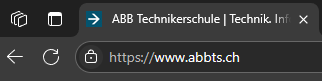
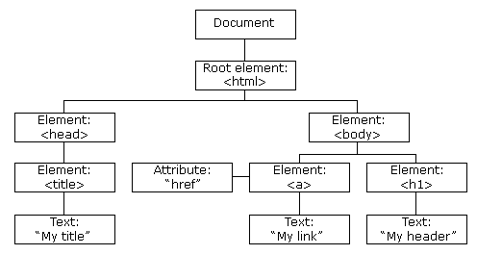

# **NDS - Web Engineering**

## Grundlagen 2 - **HTML**-**CSS**-**JS**-**DOM**

<style>
  h1 {
    --uno: shadow-filter;
  }
</style>

---

# Programm

<v-clicks :depth="2">

1. Aufwärmtraining für das 🧠
2. Erweitertes HTML & CSS *(Teilweise Repetition)*
   1. **Favicon**
   2. **CSS**: Klassen und Ids
   3. **HTML**: Tabelle
3. Einführung in
   1. **JavaScript**
   2. **Document Object Model (DOM)**

</v-clicks>

---

# **Repetition**: ABC-Quiz-Wettbewerb 🐎🏎️

<v-clicks>

## Orientierung

- Bilden sie 3 Gruppen à je 3 👃
- Jede Gruppe erhält Flip-Chart-Papiere und Stifte und zieht sich in eine Ecke oder ein anderes Klassenzimmer zurück, so dass andere Teams nicht «spicken» können

</v-clicks>

<v-clicks>

## Auftrag

Finden sie **für alle Buchstaben im Alphabet** einen **beliebigen Begriff** aus dem Bereich *"Web Engineering"*.

- Erlaubt sind beliebige **Nomen**, **Adjektive** und auch **Verben**
- Begriffe können **Technologien**, **Handlungen**, **Tools**, **Eigenschaften**, etc. sein
- Die Begriffe sollten im weitesten Sinne einen **Zusammenhang** mit dem **Kurs** haben
- Fällt ihnen nichts ein? ➡️ Überlegen sie **kreativ**! 🤓
- **Zeit** ⏰: max. 10'

</v-clicks>

<v-click>

<div class="w-full mt-10 flex flex-row justify-center">
  <h1>Das <strong>schnellste</strong> Team erhält einen <strong>Preis</strong> 🏆🎉!</h1>
</div>

</v-click>

<style>
  li {
    --uno: text-sm;
  }
</style>

---

# HTML-Favicon 🖼️

- Das Favicon ist ein kleines Bild, das neben dem Seitentitel im Browser-Tab angezeigt wird.
- **Mögliche Bildformate**: ICO, PNG, GIF, JPEG, SVG
- **Media-Typ**: [MIME type (IANA media type)](https://developer.mozilla.org/en-US/docs/Web/HTTP/Basics_of_HTTP/MIME_types#image_types)
- **Weitere Infos**: <https://www.w3schools.com/html/html_favicon.asp>



<Arrow x1="170" y1="230" x2="155" y2="250" color="red" />

## HTML Code

```html
<!DOCTYPE html>
<html>
  <head>
    <title>ABB Technikerschule | Technik. Informatik. Wirtschaft. Management.</title>
    <link rel="icon" type="image/png" sizes="32x32" href="/temp/compressed_favicon-32x32.webp">
  </head>
</html>
```

---
layout: two-cols
---

# **HTML & CSS**: das Klassenattribut (*Repetition*)

- Das HTML-`class` Attribut wird verwendet um eine Klasse für ein HTML-Element anzugeben.
- **Mehrere** HTML-Elemente können **dieselbe Klasse teilen**.
- **Ein** HTML-Element kann **mehrere Klassen** haben und so die **Eigenschaften aller Klassen** erben.

::right::

```html {monaco-run} { lineNumbers: 'on', height: '220px' }
<!DOCTYPE html>
<html>
  <head>
    <style>
      .ort {
        background-color: tomato;
        color: white;
      }

      .hauptort {
        text-align: center;
      }
    </style>
  </head>
  <body>
    <h2>CSS Klassen</h2>
    <h3 class="ort hauptort">Aarau</h3>
    <h3 class="ort">Baden</h3>
    <h3 class="ort">Brugg</h3>
    <h3 class="ort">Zofingen</h3>
  </body>
</html>
```

---
layout: two-cols
---

# HTML & CSS: Das ID-Attribut (*Repetition*)

- Das HTML-`id` Attribut wird verwendet, um eine **eindeutige ID** für **ein HTML-Element** anzugeben.
- Ein HTML-Dokument kann **nicht mehr als ein Element mit derselben ID** enthalten.

::right::

```html {monaco-run} { lineNumbers: 'on', height: '220px' }
<!DOCTYPE html>
<html>
  <head>
    <style>
      #meinHeader {
        background-color: lightblue;
        color: white;
        padding: 40px;
        text-align: center;
      }
    </style>
  </head>
  <body>
    <h2>Das ID-Attribut</h2>
    <h1 id="meinHeader">Mein Header</h1>
  </body>
</html>
```

---
layout: two-cols-header
class: m-1
---

# HTML-Tabellen 1

- Mit **HTML-Tabellen** können Daten in **Zeilen** und **Spalten** dargestellt werden
- Mit `<tr>` wird eine **Zeile** *(table row)* definiert
- Mit `<td>` wird eine **Zelle** *(table data)* definiert. Ein `<th>` ist eine Kopf-Zelle *(table heading)*

::left::

<<< ./public/assets/day-2-tables-1.html {monaco} { lineNumbers: 'on', height: '300px', readOnly: true }

::right::

<iframe style="height: 300px;" class="w-full h-full bg-white" src="/assets/day-2-tables-1.html" />

---
layout: two-cols-header
class: m-1
---

# HTML-Tabellen 2

<div>
Tabellen lassen sich sehr vielfältig anpassen: <a href="https://www.w3schools.com/html/html_table_borders.asp">Mehr Infos</a>
</div>

::left::

<<< ./public/assets/day-2-tables-2.html html {monaco} { lineNumbers: 'on', height: '400px', readOnly: true }

::right::

<iframe style="height: 400px;" class="w-full h-full bg-white" src="/assets/day-2-tables-2.html" />

---
layout: two-cols-header
class: m-1
---

# HTML-Tabellen 3

- Modernes CSS ist sehr mächtig
- **Mehr Infos**:
  - https://www.w3schools.com/html/html_table_styling.asp
  - https://developer.mozilla.org/en-US/docs/Web/CSS/:nth-child

::left::

<<< ./public/assets/day-2-tables-3.html html {monaco} { lineNumbers: 'on', height: '360px', readOnly: true }

::right::

<iframe class="w-full h-full bg-white" src="/assets/day-2-tables-3.html" />

<style>
  li {
    --uno: text-sm;
  }
</style>

---

# **Auftrag**: Tabelle stylen *(Zielvorgabe)*

<v-clicks>

1. **Laden** sie den <a href="/assets/day-2-assignment-1-source.zip">Source Code</a> herunter und entpacken die enthaltenen Dateien in ihre **VSCode** Umgebung.
2. **Starten** sie den Webserver mit "Go Live" in **VSCode**
3. **Ergänzen** sie die Datei `style.css` ausschliesslich mit **CSS-Regeln**, so dass die Seite wie folgt aussieht:

<iframe style="zoom: 0.5;" class="w-full h-190 bg-white" src="/assets/day-2-assignment-1.html" />

</v-clicks>

<style>
  li {
    --uno: text-sm;
  }
</style>

---
layout: two-cols-header
---

# **Auftrag**: Tabelle stylen *(Hilfestellung)*

::left::

- Suchen sie nicht zu weit – die meisten Dinge haben sie entweder heute oder in der
Vergangenheit schon gesehen.
- Für einzelne Dinge müssen sie ggf. etwas *recherchieren* oder *nachlesen*. ➡️ *Dies ist gewollt*: die meisten
Entwickler haben nicht alles im Kopf, sondern effiziente Recherche und Konsultation von Dokumentationen ist eine professionelle Notwendigkeit unseres Berufsstandes.
- Damit diese Übung nicht ausartet, haben sie unten eine kleine Auswahl interessanter Links...

## Links

- https://www.w3schools.com/html/html_table_borders.asp
- https://www.w3schools.com/html/html_table_padding_spacing.asp
- https://www.w3schools.com/html/html_table_styling.asp
- https://developer.mozilla.org/en-US/docs/Web/CSS/font-weight
- https://developer.mozilla.org/en-US/docs/Web/CSS/font-style
- https://developer.mozilla.org/en-US/docs/Web/CSS/:nth-child
- https://developer.mozilla.org/en-US/docs/Web/CSS/text-transform
- https://developer.mozilla.org/en-US/docs/Web/CSS/text-wrap

::right::

## Allgemeine Gedankenanstösse

- Bringen sie der Tabelle bei
  - Nicht zu gross zu werden
  - Nach rechts und links einen symetrischen äusseren Abstand zu haben - ev. gibt es einen "automatischen" Wert für eine Abstandsregel...?
  - Die Ränder sind auffallend schmal…
- Die Titel der einzelnen Spalten
  - haben eigene Farben und eine fette Schrift
  - Im HTML-Code sind die Titel gewöhnliche Nomen wie „Rang“, „Name“, etc. – ev. gibt es
eine Möglichkeit, via CSS-Regeln Texte gross- oder kleingeschrieben darstellen zu
lassen...?
- Die Bildgrösse muss beschränkt, bzw. vereinheitlicht werden…
- Die erste und dritte Spalte (resp. jeweils das erste, bzw. dritte Element jeder Zeile…) haben
eigene Styles…
- Jede zweite Zeile hat eine andere Hintergrundfarbe…
- Die letzte Zelle jeder Zeile hat die Eigenschaft, dass Text nicht umbrechen darf…

<style>
  li {
    --uno: text-sm;
  }
</style>

---
transition: slide-left
layout: two-cols-header
---

# **Lösungsvorschlag**: Tabelle stylen

<iframe style="zoom: 0.5;" class="w-full h-100 bg-white" src="/assets/day-2-assignment-1.html" />

::left::

<<< ./public/assets/day-2-assignment-1.html html {monaco} { lineNumbers: 'on', height: '240px', readOnly: true }

::right::

<<< ./public/assets/day-2-assignment-1.css css {monaco} { lineNumbers: 'on', height: '240px', readOnly: true }

---

# Was ist **JavaScript**?

<v-clicks>

- JavaScript *(kurz JS)* ist eine **leichtgewichtige**, **interpretierte** (oder just-in-time kompilierte ➡️ [JIT](https://de.wikipedia.org/wiki/Just-in-time-Kompilierung)) **Programmiersprache**.
- Der Sprachkern ist als **ECMAScript** (ECMA 262) standardisiert.
- JavaScript wurde 1995 von Netscape für dynamisches HTML in Webbrowsern entwickelt, um Benutzerinteraktionen auszuwerten, Inhalte zu verändern, nachzuladen oder zu generieren und so die Möglichkeiten von HTML zu erweitern.
- Der heutige Name der ursprünglich LiveScript genannten Sprache entstand 1996 aus einer Kooperation von Netscape mit Sun Microsystems. Um die *Popularität von Java zu nutzen*, wurde LiveScript in JavaScript umbenannt, obwohl die beiden Sprachen voneinander unabhängig entwickelt wurden und *völlig unterschiedliche Grundkonzepte aufweisen*.
- Obwohl es vor allem als Skriptsprache für Webseiten bekannt ist, wird es auch von vielen Nicht-Browser-Umgebungen verwendet, z. B. Node.js, Deno, Bun, Apache CouchDB und Adobe Acrobat. Es existieren sogar ganze cross-platform App-Frameworks (z.B. [Electron.js](https://www.electronjs.org/) oder [Cordova](https://cordova.apache.org/)), die vollständig auf Webtechnologien (HTML, CSS und JavaScript) basieren - *VSCode basiert z.B. auf Electron.js*!
- JavaScript ist eine [prototypbasierte](https://de.wikipedia.org/wiki/Prototypenbasierte_Programmierung) *(klassenlose Objektorientierung)*, multiparadigmenbasierte, dynamische *Singlethread-Sprache*, die inzwischen auch objektorientierte, imperative und deklarative (z. B. funktionale Programmierung) Stile unterstützt.
- JavaScript ist nativ in allen Webbrowsern vorhanden und kann ohne Installation Verwendet werden.
- JavaScript ist eine der drei Sprachen des Web:
  - **HTML** zum definieren des **Inhalts** von Webseiten
  - **CSS** zum spezifizieren des **Layouts** von Webseiten
  - **JavaScript** zum programmieren des **Verhaltens** von Webseiten

</v-clicks>

<style>
  li {
    --uno: text-sm;
  }
</style>

---

# JavaScript - Syntax

<v-clicks>

<div>JS definiert zwei Arten von Werten:</div>

- *Fixe* Werte (sog. *Literale*): ➡️ *lateinisch **littera** für Buchstabe = "wörtlich"*
- *Veränderbare* Werte (sog. *Variablen*)

## Literale

- Numbers (z.B. `1001`, `3.1415`)
- Strings (z.B. `"ABB-TS"` oder `'ABB-TS'`)

## Variablen

```js
let variable = "Veränderbarer Variablenwert";
const konstante = 3.1415;

// ACHTUNG: nicht mehr benutzen!
var alteVarieble = true
```

</v-clicks>

---

# JavaScript - `let` & `const`

<v-clicks :depth="2">

- Vor 2015 war das Schlüsselwort `var` die einzige Möglichkeit in JS, Variablen zu deklarieren
- Mit ECMAScript 6 wurden die neuen Schlüsselworte `let` und `const` eingeführt, welche `var` komplett ersetzen:
  - **let**: deklariert eine *veränderbare/beschreibbare* Variable
  - **const**: deklariert eine konstante, bzw. lesbare Variable, die *nicht modifiziert werden* kann.
- Details zur genauen Funktionsweise werden hier anschaulich dargestellt: https://www.w3schools.com/js/js_let.asp

</v-clicks>

<v-clicks>

`var` ist eine historische **Misskonzeption** und sollte **nicht verwendet** werden:

1. z.B. **Gültigkeitsbereich**: Variablen, die mit `var` deklariert werden, haben einen Funktions- oder globalen Gültigkeitsbereich, was zu unerwartetem Verhalten führen kann. *Im Gegensatz dazu haben `let` und `const` einen Block-Gültigkeitsbereich, der sicherer und intuitiver ist.*
2. z.B. **Mehrfachdeklaration**: Mit `var` kann eine Variable innerhalb desselben Gültigkeitsbereichs mehrfach deklariert werden, was zu unerwarteten Überschreibungen führen kann. *`let` und `const` verhindern dies.*

<div class="mt-5 flex flex-row justify-center">
  <span class="text-xl">Es gibt in der heutigen Web-Welt <strong>keinen rationalen Grund</strong> (mehr), <code>var</code> zu verwenden!</span>
</div>

</v-clicks>

<style>
  li {
    --uno: text-sm;
  }
</style>

---

# JavaScript - Kommentare, Bezeichner und Namen

<v-clicks>

- Code nach doppelten Schrägstrichen oder zwischen und wird als Kommentar behandelt.

  ```js
  // Ich bin ein einzeiliger Kommentar

  /* Ich bin ein Kommentar,
     der sich über mehrere Zeilen
     hinstrecken kann */
  ```

- Bezeichner werden verwendet, um Variablen, Schlüsselwörter und Funktionen zu benennen.
- Die Regeln für legale Namen sind ähnlich wie in den meisten Programmiersprachen.
- Ein JavaScript-Name muss wie folgt beginnen:
  - Ein Buchstabe (`A-Z` oder `a-z`)
  - Ein Dollarzeichen (`$`)
  - Oder ein Unterstrich (`_`)

</v-clicks>

---
layout: two-cols
---

# JavaScript - Datentypen

- JavaScript ist dynamisch typisiert. Das bedeutet, dass die Zuweisung von Werten an Variablen keinen typbasierten Einschränkungen unterliegt.
- Aufgrund der dynamischen Typisierung ist der Datentyp keine Eigenschaft einer Variablen, sondern Laufzeit-bezogen die Eigenschaft ihres aktuellen Wertes.

➡️ Ein grosser *Kritikpunkt* vieler Entwickler an JS: **keine Typensicherheit!**

➡️ Wir kommen später noch darauf zu sprechen... Stichwort: <logos-typescript /> <fluent-emoji-eyes />...

::right::

```js {monaco} { lineNumbers: 'on', readOnly: true }
// String
"Ein Text..."

// Number (Gleitkomma + Ganzzahlen)
123.45

// Boolean
true; false

// Null: epliziter "leerer" Wert
null

// Undefined: z.B. variable deklariert aber nicht zugewiesen
undefined

// Symbol (primitiver datentyp, garantiert einzigartig - auch wenn selbe Beschreibung)
Symbol(":-)")

// Objekt
{ key: "value" }

// Array
[1, "text", false]

// Function
function name(wert) {
  return wert;
}
```

---
layout: two-cols-header
---

# JavaScript - Operatoren & Ausdrücke (Expressions)

::left::

<v-clicks>

- JS verwendet arithmetische Operatoren (`+ - * /`) um Werte zu berechnen: `(5 + 6) * 10`
- JS verwendet den Zuweisungsoperator (`=`) um Variablen Werte zuzuweisen:

  ```js
  let variable = "Text";
  const konstante = 1234;
  let x, y;
  x = 5;
  y = 6;
  ```

- Es gibt noch viele weitere Operatoren – die meisten sind jenen anderer Programmiersprachen in vielerlei Hinsicht ähnlich: https://www.w3schools.com/js/js_operators.asp

</v-clicks>

::right::

<v-clicks>

- Ein *Ausdruck (Expression)* ist eine *Kombination* von *Werten*, *Variablen* und *Operatoren* die gemeinsam *einen Wert berechnen*.
- Die Berechnung wird als Auswertung (Evaluation) bezeichnet:

  ```js
  5 * 10;
  (5 + 6) / 10;
  "Hallo" + " " + "ABB-TS";
  let x = 5 + 6;
  let y = x * 10;
  ```

</v-clicks>

---

# JavaScript - Vergleiche und logische Operatoren

- JS hat ein paar eigenwillige und gewöhnungsbedürfte Eigenheiten, die unerfahrenen Entwicklern das Leben schwer machen können, wenn sie nicht über das nötige Wissen verfügen.
- Gewisse Eigenheiten sind bedingt durch historische Fehlentscheide, andere sind der dynamischen Natur von JS geschuldet und kommen auch in anderen dynamischen Sprachen vor (z.B. PHP, Perl)

Angenommen wir haben `const x = 5;` führt dies zu folgenden Ergebnissen:

| Operator | Beschreibung                      | Vergleich   | Rückgabewert |
| -------- | --------------------------------- | ----------- | ------------ |
| `==`     | equal to                          | `x == 8`    | `false`      |
|          |                                   | `x == 5`    | `true`       |
|          |                                   | `x == "5"`  | `true`       |
| `===`    | equal value and equal type        | `x === 5`   | `true`       |
|          |                                   | `x === "5"` | `false`      |
| `!=`     | not equal                         | `x != 8`    | `true`       |
| `!==`    | not equal value or not equal type | `x !== 5`   | `false`      |
|          |                                   | `x !== "5"` | `true`       |
|          |                                   | `x !== 8`   | `true`       |
| `>`      | greater than                      | `x > 8`     | `false`      |
| `<`      | less than                         | `x < 8`     | `true`       |
| `>=`     | greater than or equal to          | `x >= 8`    | `false`      |
| `<=`     | less than or equal to             | `x <= 8`    | `true`       |

<style>
  p {
    --uno: my-2
  }
  table, th, td {
    --uno: m-0 p-0;
  }
  li, td {
    --uno: text-sm;
  }
</style>

---

# JavaScript - Bedingungen

```js {monaco} { lineNumbers: 'on', readOnly: true }
if (condition) {
  // block of code to be executed if the condition is true
}
else {
  // block of code to be executed if the condition is false
}

switch (expression) {
  case x:
    // code block
    break;
  case y:
    // code block
    break;
  default:
    // code block
}
```

---
layout: two-cols-header
---

# JavaScript - Truthy & Falsy

::left::

- **Jeder Wert** in JS kann zu einem **Boolean «umgewandelt»** werden
  - Alles mit einem «Wert» ergibt `true`
  - Alles andere ergibt `false`
- Das Truthy & Falsy-Konzept
  - Ist eine der häufigsten Fehlerquellen und es erwischt regelmässig auch sehr erfahrene Entwickler *(jep, me too!)*
  - Ist eine direkte Konsequenz der dynamischen Natur von JS
  - Wird NICHT verschwinden – so deal with it!
  - kann auch Vorteile haben – alles eine Frage der Betrachtung 🤓

| Truthy Werte | Falsy Werte |
| ------------ | ----------- |
| `true`       | `false`     |
| `"text"`     | `""`        |
| `72`         | `0`         |
| `-72`        | `-0`        |
| `Infinity`   | `NaN`       |
| `-Infinity`  | `null`      |
| `{}`         | `undefined` |
| `[]`         |             |

::right::

```js {monaco-run} { lineNumbers: 'on', height: '350px', readOnly: true }
function barTest(argument) {
  if (argument.bar) {
    console.log(argument.bar);
  }
  else {
    console.error("😭");
  }
}

const foo = {};

barTest(foo);

foo.bar = "🍻";

barTest(foo);
```

<style>
  li {
    --uno: text-sm;
  }
  table {
    --uno: mt-2;
  }
  table, th, td {
    --uno: p-0;
  }
</style>

---
layout: two-cols-header
---

# JavaScript - Funktionen

::left::

- JS-Funktionen werden mit dem Schlüsselwort `function` definiert:

  ```js
  function functionName(parameters) {
    // code to be executed
  }

  function myFunction(a, b) {
    return a * b;
  }
  ```

::right::

- Die sog. "Arrow-Functions" sind mit ES6 erschienen, die u.A. eine kürzere Schreibweise erlauben.
- Wenn die Funktion nur eine Aweisung hat (und ggf. einen Wert zurückgibt), können Block `{}` sowie `return` weggelassen werden:

  ```js
  let myFunction = (a, b) => a * b;
  const result = myFunction(2, 3);
  ```

- Wir werden "Arrow-Functions" später nochmals im Zusammenhang mit Events begegnen...

---

# JavaScript - Objekte

```js {monaco-run} { lineNumbers: 'on', height: '300px', readOnly: true }
const auto = { type: "Fiat", model: "500", color: "white" };
const person = { vorname: "Hansli", nachname: "Bireweich", alter: 9, augenfarbe: "blau" };

// Abfragen ('index'-syntax oder property-syntax)
const abfrage = auto["type"] + ", " + person.alter;

console.log(abfrage);

// Ändern
auto.color = "red";
person["vorname"] = "Schälle-Ursli";

console.log(`${auto.color}, ${person["vorname"]}`);

// dynamisch objekt ändern
person.ganzerName = function() {
  return `${this.vorname} ${this.nachname}`;
}
console.log(person);
```

---

# JavaScript - Arrays

```js {monaco-run} { lineNumbers: 'on', height: '300px', readOnly: true }
const automarken = ["BMW", "Volvo", "Mini", "Toyota"];

// Abfragen
let automarke = automarken[0];

console.log(1, automarken);

// Ändern
automarken[0] = "Opel";

console.log(2, automarken);

// Arrays sind spezielle Objekte, ihre Attribute sind immer Zahlenindexe
const gemischt = ["hallo", 3.1415, false, {}, [1, 2, 3]];

automarken.length; // Gibt die Anzahl Elemente zurück
automarken.sort(); // sortiert das Array
automarken.push("Kia"); // Fügt einen neuen Eintrag ans ENDE des Arrays

console.log(3, automarken);

const letztesElement = automarken.pop(); // Entfernt das letzte Element aus dem Array
const andereAutomarken = automarken.splice(1, 2); // Entfernt Elemente beginnend beim Index und für die gewünschte Anzahl

console.log(4, automarken, andereAutomarken, letztesElement);
```

---

# JavaScript - Schleifen 1

```js {monaco} { lineNumbers: 'on', height: '100px', readOnly: true }
for (expression1; expression2; expression3) { /* code block to be executed */ }

for (key in object) { /* code block to be executed */ }

for (variable of iterable) { /* code block to be executed */ }
```

```js {monaco-run} { lineNumbers: 'on', height: '250px', readOnly: true }
const person = { vorname: "Hansli", nachname: "Bireweich", alter: 9 };
const automarken = ["BMW", "Volvo", "Mini"];
let text = "for: ";

for (let i = 0; i < 5; i++) {
  text += " -> " + i;
}

console.log(text);
text = "for-in: ";

for (let x in person) {
  text += " -> " + person[x];
}

console.log(text);
text = "for-of: ";

for (let x of automarken) {
  text += " -> " + x;
}

console.log(text);
```

---

# JavaScript - Schleifen 2

```js {monaco} { lineNumbers: 'on', height: '65px', readOnly: true }
while (condition) { /* code block to be executed */ }

do { /* code block to be executed */ } while (condition);
```

```js {monaco-run} { lineNumbers: 'on', height: '300px', readOnly: true }
let text = "while: ";
let i = 0;

while (i < 10) {
  text += " -> " + i;
  i++;
}

console.log(text);
text = "do-while: ";
i = 0;

do {
  text += " -> " + i;
  i++;
} while (i < 10)

console.log(text);

```

---
layout: two-cols-header
---

# Der HTML DOM (Document Object Model)

::left::

<v-click>



</v-click>

::right::

<v-clicks :depth="2">

- Mit dem HTML-DOM kann JavaScript auf alle Elemente eines HTML-Codes zugreifen und diese ändern
- Wenn eine Webseite geladen wird, erstellt der Browser ein Document Object Model der Seite.
- Das HTML-DOM-Modell ist als Struktur von Objekten aufgebaut.
- Mit dem Objektmodell ist unser Werkzeugkasten vollständig:
  - JavaScript kann alle **HTML-Elemente** auf der Seite *ändern*
  - JavaScript kann alle **HTML-Attribute** auf der Seite *ändern*
  - JavaScript kann alle **CSS-Stile** auf der Seite *ändern*
  - JavaScript kann **vorhandene HTML-Elemente und -Attribute** *entfernen*
  - JavaScript kann **neue HTML-Elemente und -Attribute** *hinzufügen*
  - JavaScript kann auf **alle vorhandenen HTML-Ereignisse** auf der Seite *reagieren*
  - JavaScript kann **neue HTML-Ereignisse** auf der Seite *erzeugen*

</v-clicks>

<style>
  img {
    --uno: pr-3;
  }
  li {
    --uno: text-sm;
  }
</style>

---

# HTML DOM: Document

## HTML-Elemente finden

```js {monaco} { lineNumbers: 'on', readOnly: true }
// Finde ein Element anhand seiner 'id'
const myElement = document.getElementById("my-id");

// Gibt ein Array mit allen 'p' Elementen zurück
const allPElement = document.getElementsByTagName("p");

// Gibt ein Array mit allen Elementen, welche u.A. die Klasse "my-class" referenzieren
const allMyClassElements = document.getElementsByClassName("my-class")
```

## Ändern von HTML-Elementen

```js {monaco} { lineNumbers: 'on', readOnly: true }
// Ändern des inneren HTMLs eines Elements
myElement.innerHTML = "Hello";

// Ändern des styles eines Elements
myElement.style.color = "red";
```

---

# JavaScript & DOM: Ereignisse

- Logik kann ausgeführt werden, wenn ein Ereignis eintritt, z.B. wenn ein Benutzer auf ein HTML-Element klickt.
- Beispiele für HTML-Ereignisse:
  - Wenn ein Benutzer mit der Maus klickt
  - Wenn eine Webseite geladen wurde
  - Wenn ein Bild geladen wurde
  - Wenn Sie mit der Maus über ein Element fahren
  - Wenn ein Eingabefeld geändert wird
  - Wenn ein HTML-Formular gesendet wird
  - Wenn ein Benutzer eine Taste drückt
- Details: https://www.w3schools.com/js/js_htmldom_events.asp

---
layout: two-cols-header
---

# JavaScript & DOM: Zusamenspiel

::left::

<<< ./public/assets/day-2-dom-and-js.html html {monaco} { lineNumbers: 'on', height: '400px', readOnly: true }

::right::

<iframe class="w-full h-full bg-white m-3" src="/assets/day-2-dom-and-js.html" style="height: 400px;" />

---
layout: two-cols-header
---

# **Auftrag**: Eine TODO-App programmieren

- Programmieren sie eine App, die sich so verhält wie im Beispiel rechts
- Benützen sie den vorgegebenen HTML-Code als Basis

::left::

<<< ./public/assets/day-2-assignment-todo.html html {monaco} { lineNumbers: 'on', height: '370px', readOnly: true }

::right::

<iframe class="w-full h-100 bg-white m-3" src="/assets/day-2-assignment-todo-solution.html" style="height: 370px;" />

---

# Hausaufgabe

<v-clicks :depth="4">

- Ihr Auftrag ist es, die gelernten Kursinhalte zu **wiederholen**, zu **ergänzen** und zu **vertiefen**, indem sie das [JavaScript
Tutorial der W3Schools](https://www.w3schools.com/js/default.asp) durchspielen.
- Spielen sie dabei folgende Kapitel durch
  - [JS HOME](https://www.w3schools.com/js/default.asp) -> [JS Iterables](https://www.w3schools.com/js/js_iterables.asp)
    - **Überspringen** sie dabei folgende Kapitel,
      - [JS BigInt](https://www.w3schools.com/js/js_bigint.asp): ist zwar spannend, aber hat für diesen Kurs keinen Mehrwert
      - [JS Dates](https://www.w3schools.com/js/js_dates.asp) -> [JS Date Set Methods](https://www.w3schools.com/js/js_date_methods_set.asp): die `DateTime` implementation von JS kommt direkt aus der Hölle...🤬 -> benützen sie für `DateTime`-Belange [Luxon](https://moment.github.io/luxon/#/)
  - [DOM Intro](https://www.w3schools.com/js/js_htmldom.asp) -> [DOM CSS](https://www.w3schools.com/js/js_htmldom_css.asp)
- Falls sie mit den heutigen Übungen nicht fertig geworden sind, beenden sie diese auf das nächste mal.

</v-clicks>

---

# Ende der heutigen Veranstaltung

<div class="text-center mt-9">

Vielen herzlichen Dank für eure **Aufmerksamkeit** und **Mitarbeit** 💝!

Kommt alle gut nach Hause, viel Erfolg bei den Hausaufgaben und eine gute, lehrreiche Woche👌

👋 bis nächsten Freitag!

</div>