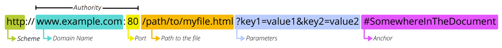
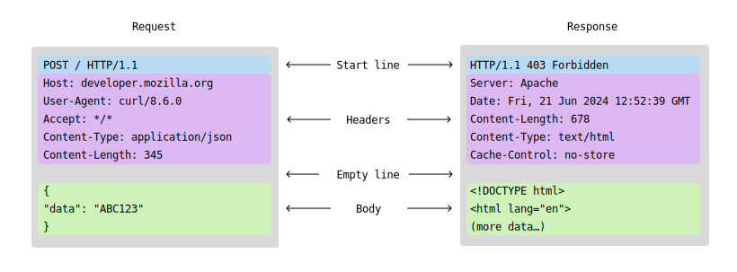
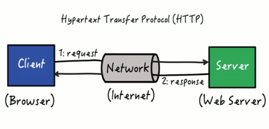
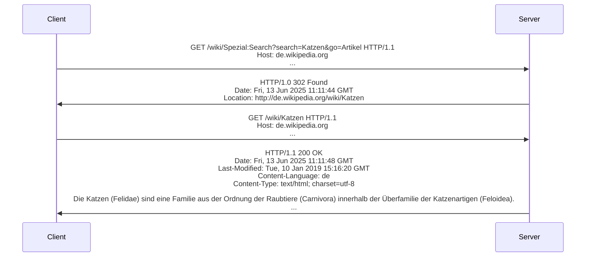
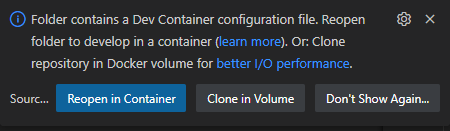

# **NDS - Web Engineering**

## Grundlagen 3 - Client-Server

<style>
  h1 {
    --uno: shadow-filter;
  }
</style>

---
transition: slide-left
---

# Programm

<v-clicks :depth="2">

1. Hausaufgaben: Besprechung & Lösungen
2. Hypertext Transfer Protocol
3. URI + URL
4. Http Nachrichten, Abfragemethoden & Statuscodes
5. Webserver
6. Datenübertragung mit HTML-Forms

</v-clicks>

---
transition: slide-left
---

# **Lösungsvorschlag**: Todo-App *(Aufgabe von Tag 2)*

<<< ./public/assets/day-2-assignment-todo-solution.html html {monaco} { lineNumbers: 'on', height: '440px' }

---
transition: slide-left
---

# Hypertext Transfer Protocol

<v-clicks>

- Das Hypertext Transfer Protocol (HTTP) ist ein 1991 eingeführtes **zustandsloses Protokoll zur Übertragung von Daten** über ein Rechnernetz.
- Es wird hauptsächlich eingesetzt, um **Webseiten** in einen **Webbrowser** zu laden. Es ist jedoch nicht prinzipiell darauf beschränkt und auch als **allgemeines Dateiübertragungsprotokoll** *sehr verbreitet*.
- Aktuelle Version ist **HTTP/3**, welche im Juni 2022 veröffentlicht wurde.
- HTTP verwendet standardmäßig **Port 80** für **unverschlüsselte** und **Port 443** für **verschlüsselte Übertragung**.
- Es gibt zu HTTP ergänzende und darauf aufbauende Standards wie **HTTPS** für die **Verschlüsselung übertragener Inhalte**.

</v-clicks>

---
transition: slide-left
---

# Uniform Resource Identifier (URI)

<v-clicks>

- Ein Uniform Resource Identifier (Abk. URI, englisch für «einheitlicher Bezeichner für Ressourcen») ist ein **Identifikator** und besteht aus einer Zeichenfolge, die zur **Identifizierung einer abstrakten oder physischen Ressource** dient.
- **URIs** werden zur **Bezeichnung von Ressourcen** *(wie Webseiten, sonstigen Dateien, Aufruf von Webservices, aber auch E-Mail-Empfängern)* im Internet und dort vor allem im WWW eingesetzt
- Beispiele
  - https://de.wikipedia.org/wiki/Uniform_Resource_Identifier
  - ftp://ftp.is.co.za/rfc/rfc1808.txt
  - mailto:John.Doe@example.com
  - sip:911@pbx.mycompany.com
  - tel:+1-816-555-1212
  - git://github.com/rails/rails.git
- Ein URI besteht aus fünf Teilen *(wovon nur **scheme** und **path** in jedem URI vorhanden sein müssen)*:
  - **scheme** (Schema oder Protokoll)
  - **authority** (Anbieter oder Server)
  - **path** (Pfad)
  - **query** (Abfrage)
  - **fragment** (Teil)

</v-clicks>

<v-click>

```text
  foo://example.com:8042/over/there?name=ferret#nose
  \_/ \________________/\_________/ \_________/ \__/
   |          |             |            |        |
  scheme    authority        path        query   fragment
```

</v-click>

<style>
  li {
    --uno: text-sm;
  }
</style>

---
transition: slide-left
---

# Uniform Resource Locator (URL)

<div></div>

<v-click>



</v-click>

<v-clicks>

- Eine Untermenge von URI
- Identifiziert eine Webaddresse oder Ort einer eindeutigen Web-Ressource
- Die **erforderlichen Teile** einer URL hängen in hohem Maße vom **Kontext** ab, in dem die URL verwendet wird. Es wird zwischen **absoluten** und **relativen URLs** unterschieden:
  - In der **Adressleiste eines Browsers** hat eine URL *keinen Kontext*, daher muss eine *vollständige (oder absolute) URL* angegeben werden.
  - Wenn eine *URL in einem Dokument* verwendet wird (z. B. in einer HTML-Seite) kann der **Webbrowser** diese Informationen verwenden, um ggf. *fehlende Teile zu ergänzen*.

</v-clicks>

<v-click>

| Absolute URLs                                                          | Relative URLs                                                   |
| ---------------------------------------------------------------------- | --------------------------------------------------------------- |
| **Vollständige URL**: `https://developer.mozilla.org/en-US/docs/Learn` | **Unterressourcen**: `Skills/Infrastructure/Understanding_URLs` |
| **Impliziter Domänenname**: `/en-US/docs/Learn`                        | **Eine Ebene höher**: `../CSS/display`                          |

</v-click>

<style>
  li {
    --uno: text-sm;
  }
  code {
    --uno: text-xs;
  }
</style>

---
transition: slide-left
---

# URL Encoding

<v-clicks :depth="2">

- URL-Encoding *(URL-Kodierung, auch Prozentkodierung genannt)* ist ein Mechanismus, der dazu dient, Informationen in einer URL unter bestimmten Gegebenheiten zu kodieren.
- Ohne diese Kodierung wären einige Informationen nicht in einer URL darstellbar.
  - Ein **Leerzeichen** wird in aller Regel vom Browser als **Ende der URL interpretiert**, nachfolgende Zeichen würden *ignoriert* oder führten zu einem *Fehler*.
  - Bestimmte Zeichen sind für die URL reserviert (z.B. `#`)
- **Beispiel**:
  - *Problem*: Wir möchten den Wert `A54C6FE2#info` als **Parameter** übertragen – das ist nicht direkt möglich: `http://www.example.net/index.html?session=A54C6FE2#info`
    
  - *Lösung mit URL-Encoding*:
    - Laut [ASCII](https://www.ascii-code.com/) ist dem Zeichen `#` der hexadezimale **Zeichencode 23** zugeordnet, was nach URL-Encoding-Notation `%23` ergibt. Somit lässt sich die Information `A54C6FE2#info` via folgende URL korrekt übertragen: `http://www.example.net/index.html?session=A54C6FE2%23info`
</v-clicks>

<Arrow v-click="7" color="red" x1="700" y1="325" x2="485" y2="275" />
<Arrow v-click="8" color="red" x1="700" y1="325" x2="510" y2="430" />

<style>
  li {
    --uno: text-sm;
  }
</style>

---
layout: two-cols-header
---

# HTTP Nachrichten



<style>
  img[alt="HTTP-Request-Response"] {
    background: white;
    transform: scale(1.0);
    display: inline-block;
  }
</style>

::left::

<v-clicks>

- **HTTP-Nachrichten** sind die Art und Weise, wie **Daten** zwischen einem **Server** und einem **Client** *ausgetauscht* werden.
- **Es gibt zwei Arten von Nachrichten**: `Request`, die *vom Client gesendet* werden, um eine Aktion auf dem Server auszulösen, und `Response`, die *Antwort vom Server* an den Client.

</v-clicks>

::right::

<v-click :at="3">



</v-click>

<style>
  li {
    --uno: text-sm;
  }
  img[alt="HTTP"] {
    margin-top: -20px;
    margin-left: auto;
    margin-right: auto;
    width: 70%;
  }
</style>

---
transition: slide-left
---

# HTTP Abfragemethoden

Im HTTP (Hypertext Transfer Protocol) gibt es **verschiedene Anfragemethoden**, die es dem Browser ermöglichen, **Informationen**, **Formulare** oder **Dateien** an den *Server* zu senden.

Weitere Infos➡️: https://de.wikipedia.org/wiki/Hypertext_Transfer_Protocol#HTTP-Anfragemethoden


*Hannes Opinion* 🤪:

- Die HTTP-Methoden wurden (historisch) mit einem "Dateisystem"-Gedanken für ein statisches Web entwickelt, d.h. Ressourcen die **abgerufen** und **verwaltet** werden können.
- In der Praxis werden die Methoden `GET` und `POST` am häufigsten verwendet, da sich mit ihnen **alle Operationen** abbilden lassen. Die anderen Methoden sind eher aus *semantischen Gründen* interessant.

---
transition: slide-left
---

# HTTP Statuscodes

<div></div>

Jede **HTTP-Anfrage** wird vom **Server** mit einem [HTTP-Statuscode](https://developer.mozilla.org/en-US/docs/Web/HTTP/Reference/Status) beantwortet.

Er gibt zum Beispiel Informationen darüber, **ob die Anfrage erfolgreich bearbeitet wurde**, oder teilt dem Client, also etwa dem Browser, im Fehlerfall mit, wo *(zum Beispiel Umleitung)* beziehungsweise wie *(zum Beispiel mit Authentifizierung)* er die gewünschten Informationen (wenn möglich) erhalten kann.

<v-clicks>

- `1xx` – **Informationen**
  Die Bearbeitung der Anfrage dauert trotz der Rückmeldung noch an. Eine solche Zwischenantwort ist manchmal notwendig, da viele Clients nach einer bestimmten Zeitspanne (Zeitüberschreitung) automatisch annehmen, dass ein Fehler bei der Übertragung oder Verarbeitung der Anfrage aufgetreten ist, und mit einer Fehlermeldung abbrechen.
- `2xx` – **Erfolgreiche Operation**
  Die Anfrage wurde bearbeitet und die Antwort wird an den Anfragesteller zurückgesendet.
- `3xx` – **Umleitung**
  Um eine erfolgreiche Bearbeitung der Anfrage sicherzustellen, sind weitere Schritte seitens des Clients erforderlich. Das ist zum Beispiel der Fall, wenn eine Webseite vom Betreiber umgestaltet wurde, so dass sich eine gewünschte Datei nun an einem anderen Platz befindet. Mit der Antwort des Servers erfährt der Client im Location-Header, wo sich die Datei jetzt befindet.
- `4xx` – **Client-Fehler**
  Bei der Bearbeitung der Anfrage ist ein Fehler aufgetreten, der im Verantwortungsbereich des Clients liegt. Ein 404 tritt beispielsweise ein, wenn ein Dokument angefragt wurde, das auf dem Server nicht existiert. Ein 403 weist den Client darauf hin, dass es ihm nicht erlaubt ist, das jeweilige Dokument abzurufen. Es kann sich zum Beispiel um ein vertrauliches oder nur per HTTPS zugängliches Dokument handeln.
- `5xx` – **Server-Fehler**
  Es ist ein Fehler aufgetreten, dessen Ursache beim Server liegt. Zum Beispiel bedeutet 501, dass der Server nicht über die erforderlichen Funktionen (das heißt zum Beispiel Programme oder andere Dateien) verfügt, um die Anfrage zu bearbeiten.

</v-clicks>

<style>
  li {
    --uno: text-sm;
  }
</style>

---
transition: slide-left
layout: two-cols-header
---

# HTTP: der **GET**-Befehl *(1)*

::left::

## Request *(Client)*

```http
GET /hello.html HTTP/1.1
Host: 127.0.0.1:5500
```

::right::

## Response *(Server)*

```http
HTTP/1.1 200 OK
Content-Type: text/html; charset=UTF-8
Content-Length: 1728
Date: Mon, 20 May 2024 15:02:17 GMT

<!DOCTYPE html>
<html>
  <head>
    <title>Hello</title>
    <link rel="icon" type="image/png" href="/images/puss-in-boots.png" />
  </head>
  <body>
    <h1>Hello Earthling - live long & prosper 🖖!</h1>
  </body>
</html>
```

---
transition: slide-left
---

# HTTP: der **GET**-Befehl (2)

<div></div>

Der GET-Befehl kann Parameter-Wertepaare enthalten:

- Das Fragezeichen (`?`) in der URL leitet den Bereich der Parameter ein
- Das Kaufmannsund (*Ampersand*) (`&`) trennt die Wertepaare
- Die Wertepaare sind in der Form `Name=Wert` aufgebaut.

  ```http
  GET /wiki/Spezial:Search?search=Katzen&go=Artikel HTTP/1.1
  Host: de.wikipedia.org
  ...
  ```

---
transition: slide-left
---

# HTTP: der **GET**-Befehl (3)



---
transition: slide-left
layout: two-cols-header
---

# HTTP: der **POST**-Befehl

- Die HTTP-Post Methode sendet Daten an den Server.
- Der Datentyp wird durch den Header `Content-Type` angegeben

::left::

## WWW-Form-Urlencoded

Die Schlüssel und Werte werden in Schlüssel-Wert-Tupeln codiert, die durch getrennt sind, mit einem zwischen dem Schlüssel und dem Wert. Nicht-alphanumerische Zeichen in Schlüsseln und Werten sind URL-kodiert. ➡️ **NICHT** zur Übertragung von *Binärdateien* geeignet!

```http
POST /test HTTP/1.1
Host: example.com
Content-Type: application/x-www-form-urlencoded
Content-Length: 27

field1=value1&field2=value2
```

::right::

## Multipart-Form-Data

Jeder Wert wird als Datenblock ("body-Teil") gesendet, wobei jeder Teil durch ein vom Benutzer-Agent definiertes Trennzeichen ("boundary") getrennt wird. ➡️ Zur Übertragung von (grossen) *Binärdateien* **geeignet**!

```http
POST /test HTTP/1.1
Host: example.com
Content-Type: multipart/form-data;boundary="boundary"

--boundary
Content-Disposition: form-data; name="field1"

value1
--boundary
ContentDisposition: form-data: name="field2"; filename"example.png"

value2
--boundary--
```

<style>
  li {
    --uno: text-sm;
  }
</style>

---
transition: slide-left
---

# Was ist ein Webserver?

<v-clicks>

- Ein Webserver *(lateinisch servire ‚dienen‘)* ist ein **Computer**, der **Dokumente** an **Clients** wie z. B. Webbrowser überträgt.
- Als Webserver bezeichnet man den **Computer mit Webserver-Software** oder nur die **Webserver-Software** selbst.
- Webserver werden **lokal**, in **Firmennetzwerken** und überwiegend als **WWW-Dienst** im **Internet** eingesetzt.
- Dokumente können somit dem geforderten Zweck **lokal**, **firmenintern** und **weltweit** zur Verfügung gestellt werden.
- Als **Übertragungsmethoden** dienen **standardisierte Übertragungsprotokolle** (`HTTP`, `HTTPS`) und Netzwerkprotokolle wie `IP` und `TCP`, üblicherweise über `Port 80 (HTTP)` und `Port 443 (HTTPS)`.

</v-clicks>

---
transition: slide-left
---

# Aufgaben eines Webservers

<v-clicks :depth="2">

- ### Hauptaufgabe: Auslieferung von Dateien
  - z. B. unveränderlicher HTML- oder Bild-Dateien
  - Oder dynamisch erzeugter Daten, z. B. Seiten, deren Inhalte stets individuell gemäss dem Profil eines eingeloggten Benutzers erstellt werden.
- ### Weitere Funktionen
  - **Zugriffsbeschränkung**: Anbieten von Mechanismen, mit denen sich der Nutzer eines Webbrowsers gegenüber dem Webserver bzw. einer Webanwendung als Benutzer authentisieren kann, um danach für weitere Zugriffe autorisiert zu sein.
  - **Sicherheit**: Zur Verschlüsselung der Server-Client-Kommunikation wird das HTTPS-Verfahren eingesetzt.
  - **Sitzungsverwaltung**: Wenn ein Benutzer eine Website besucht, kann der Server eine Sitzung für diesen Benutzer erstellen, die es dem Server ermöglicht, Informationen wie den Anmeldestatus des Benutzers, Einstellungen und alle in Formulare eingegebenen Daten zu verfolgen.
  - **Fehlerhandling**: etwaige Fehler oder Erfolge werden dem Browser mit HTTP-Statuscodes und einer Fehlerseite mitgeteilt.
  - **Protokollierung**: Auf einem Webserver werden üblicherweise alle Anfragen in einer Logdatei protokolliert, aus der mittels Logdateianalyse Statistiken über Anzahl der Zugriffe pro Seite generiert werden können. HTTP ist ein verbindungs- und zustandsloses Protokoll. Damit ist die Zuordnung einer Anforderung zu einem Nutzer über die IP-Adresse grundsätzlich möglich.
  - **Caching**: bei großen Zugriffszahlen kann vor allem die aufwändige dynamische Inhaltsauslieferung gepuffert um so eine bessere Performance zu erreichen.

</v-clicks>

<style>
  li {
    --uno: text-3.5;
  }
</style>

---
transition: slide-left
---

# Auftrag: Minimaler Webserver mit Ktor

Hands-On-Übung

<v-clicks>

1. [Docker Desktop](https://www.docker.com/products/docker-desktop/) installieren & starten.
2. Das **Git-Repository** <https://github.com/teaching-abbts/smart-home-system> klonen.
3. Mit **VS Code** das Repository öffnen.
4. Repo im **Dev Container** öffnen:
   
   *Das öffnen des Dev Containers kann einige Minuten dauern, da die Abhängigkeiten heruntergeladen und der Container erstellt werden müssen.*
5. Im Terminal den Befehl `./gradlew run` ausführen.
6. Im Browser die URL `http://localhost:8080/` aufrufen.

</v-clicks>

<v-click>

# Gratulation, du hast einen **echten** Webserver mit Ktor erstellt und gestartet **!!**

</v-click>

<style>
  li {
    --uno: text-sm;
  }
</style>

---
transition: slide-left
layout: two-cols-header
---

# Was ist ein HTML-Form?

- Ein HTML-Form (Formular) wird verwendet, um Benutzereingaben zu sammeln.
- Die Benutzereingabe wird meistens zur Verarbeitung an einen Server gesendet.
- Ein HTML-Form besteht aus **nativen** Browserelementen und kann mit **nativen Mitteln** *(OHNE JavaScript)* Daten an den Webserver senden ➡️ [Weitere Infos](https://www.w3schools.com/html/tryit.asp?filename=tryhtml_form_submit)

::left::

<<< ./public/assets/day-3-form.html html {monaco} { lineNumbers: 'on', height: '320px' }

::right::

<iframe src="/assets/day-3-form.html" width="100%" height="500px" frameborder="0" />

---
transition: slide-left
---

# Das `<input>`-Element

- Ein natives Eingabefeld für Daten (z.B. einzeiliger Text)
- Ein `<input>` Element kann, abhängig vom Typ, auf viele Arten dargestellt werden
- Seit HTML 5 gibt es sehr viele ➡️ [Eingabearten](https://developer.mozilla.org/en-US/docs/Web/HTML/Element/Input#input_types)
- Die `<input>` können sich (je nach Webbrowser) **graphisch** und **verhaltenstechnisch** *unterscheiden*.
- Das `<input>` Element ist ein **leeres** Element, d.h. es hat kein schließendes Tag.
- Das `<input>` Element kann **Attribute** haben, die das Verhalten beeinflussen:
  - `type`: Der Typ des Eingabefelds (z.B. `text`, `password`, `email`, `number`, `checkbox`, `radio`, etc.)
  - `name`: Der Name des Eingabefelds, der beim Senden des Formulars verwendet wird
  - `value`: Der Standardwert des Eingabefelds
  - `placeholder`: Ein Platzhaltertext, der angezeigt wird, wenn das Eingabefeld leer ist
  - `required`: Gibt an, ob das Eingabefeld ausgefüllt werden muss
  - `disabled`: Deaktiviert das Eingabefeld
  - `readonly`: Macht das Eingabefeld schreibgeschützt
- Das `<input>` Element kann in einem `<form>` Element verwendet werden, um Benutzereingaben zu sammeln und an den Server zu senden.
- Das `<input>` Element kann auch mit JavaScript manipuliert werden, um z.B. den Wert zu ändern oder das Verhalten zu ändern.
- Das `<input>` Element kann auch mit CSS gestylt werden, um das Aussehen zu ändern.

<style>
  li {
    --uno: text-sm;
  }
</style>

---
transition: slide-left
---

# Look & Feel von Form-Elementen

- Das Aussehen der **nativen Elemente** ist aus Design-Sicht *suboptimal*:
- Unternehmen und Organisationen haben oft ein sog. «Corporate Design» - die **nativen Elemente** lassen sich (je nach Typ) *nur begrenzt stylen*, bzw. in ihrem Verhalten beeinflussen und können so den Gesamteindruck stören.
- Die Form-Elemente werden daher oft «verpackt» und ggf. auch durch Proxy-Elemente ersetzt um eine einheitliche Benutzererfahrung zu ermöglichen, bzw. um ein einheitliches «Look & Feel» sicherzustellen.
- Die Vielfältigkeit von HTML, JS & CSS ermöglicht die Umsetzung nahezu beliebiger Designs – allerdings sollte die Komplexität von «korrekten» Gui-Elementen nicht unterschätzt werden:
  - Native Eingabetypen sind «kampferprobt» und lösen viele Probleme und Sonderfälle bei der Bedienung (z.B. Touch / Maus & Tastatur).
  - Bsp. Um einen «customized» Button zu erstellen, der dieselben Fähigkeiten (Reagieren auf alle möglichen Touch-, Tastatur- und Mauseingaben) wie ein nativer `<button>` hat, werden ca. 1000 Zeilen JavaScript Code benötigt.

---
transition: slide-left
---

# **Live Coding**: HTML-Form und Ktor-Webserver

1. Übermitteln von Formular-Daten an den Webserver
2. Verarbeiten der Daten auf dem Server
3. Senden von Antworten an den Client
4. Übermitteln von Dateien an den Client

---
transition: slide-left
---

# Hausaufgabe

- Sie haben heute im Kurs gelernt:
  - Wie Html ausgegeben werden kann
  - Wie HTML-Forms funktionieren
  - Wie Daten & Dateien an einen Webserver übermittelt werden
  - Wie Dateien an den Client übermittelt werden
- Sie finden den heutigen Beispiel-Code auf [Github](https://github.com/teaching-abbts/smart-home-system/tree/day-3/my-first-form) (Branch `day-3/my-first-form`)

- Ihre Aufgabe für das nächste Mal: **Bauen einer einfachen Bildgalerie**
  - Unter `/image-gallery/upload` soll ein HTML-Formular sein, das es ermöglicht, Bilder hochzuladen
  - Es soll möglich sein, mehrere Bilder gleichzeitig hochzuladen *(d.h. mehrere Dateien in einem Formularfeld auswählen)*
    ➡️ Schauen sie sich das [input-Element](https://www.w3schools.com/tags/tag_input.asp) mal genauer an...
  - Die hochgeladenen Bilder sollen in einem Verzeichnis auf dem Server gespeichert werden
  - Erstellen sie unter der Route `/image-gallery` eine HTML-Seite, welche die hochgeladenen Bilder (maximal 3 Bilder in einer Zeile) anzeigt
  - Es soll möglich sein, von der Galerie-Seite aus:
    - in das Upload-Formular zu wechseln
    - einzelne Bilder zu löschen (d.h. die Datei auf dem Server zu löschen und die Galerie-Seite zu aktualisieren)

<style>
  li {
    --uno: text-sm;
  }
</style>

---
transition: slide-left
---

# Ende der heutigen Veranstaltung

<div class="text-center mt-9">

Vielen herzlichen Dank für eure **Aufmerksamkeit** und **Mitarbeit** 💝!

Kommt alle gut nach Hause, viel Erfolg bei den Hausaufgaben und eine gute, lehrreiche Woche👌

👋 bis nächsten Freitag!

</div>
